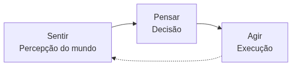
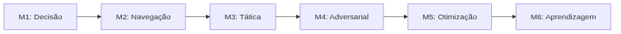

<!-- _class: cover -->


# Inteligência Artificial e Ilusão de Inteligência

## Semana 1 — Abertura da disciplina

<div class="meta">

**Curso:** Tecnologia em Jogos Digitais
**Metodologia:** Project-Based Learning
**Projeto Integrador:** AI Playground

</div>

---

## Objetivos da aula

Ao final de hoje você será capaz de:

- diferenciar IA de jogos de IA acadêmica;
- explicar o que é "ilusão de inteligência";
- descrever o ciclo Sentir → Pensar → Agir;
- reconhecer a metodologia PBL e o AI Playground;
- formar seu grupo e esboçar o Micro Game 1.

---

<!-- _class: question -->

# O que é Inteligência Artificial em jogos, e por que "ilusão"?

Pense em um NPC que já te pareceu inteligente. Ele era, de fato, inteligente?

---

## IA de jogos ≠ IA acadêmica

Dois campos com objetivos diferentes.

<div class="tip">

Uma IA "ótima" pode ser um péssimo design de jogo.

</div>

---

<!-- _class: comparison -->

## Dois critérios de sucesso distintos

<div class="columns">
<div class="col positive">

### 🎮 IA de jogos

- Credibilidade e diversão
- Custo computacional controlado
- Controle do designer sobre o comportamento

</div>
<div class="col negative">

### 🎓 IA acadêmica

- Otimalidade da solução
- Generalidade do método
- Pouca preocupação com custo em tempo real

</div>
</div>

---

## Ilusão de inteligência

Jogadores atribuem intenção e inteligência a comportamentos simples.

- **IA forte** — inteligência real e geral (não é o objetivo aqui)
- **IA fraca** — comportamento convincente, ainda que simples
- O experimento de Heider e Simmel mostra: **formas geométricas simples** já parecem "ter intenção"

<div class="curiosity">

Se o jogador acredita, a ilusão funciona — mesmo sem "inteligência" real por trás.

</div>

---

## Ilusão e fluxo de jogo

Uma IA "burra de propósito" pode manter o jogador no canal de fluxo.

<div class="industry">

O "tiro de aviso" antes do ataque letal existe para dar tempo de reação ao jogador — não porque o NPC seja incapaz de acertar de primeira.

</div>

---

<!-- _class: diagram -->

## O ciclo Sentir → Pensar → Agir



Modelo unificador de qualquer agente de IA em jogos.

> [!FIGURA]
>
> **Objetivo didático**
>
> Reforçar visualmente o ciclo Sentir-Pensar-Agir como modelo central que será retomado em todos os módulos seguintes.
>
> **Arquivo sugerido**
>
> ```
> assets/ciclo-sentir-pensar-agir.webp
> ```
>
> **Descrição**
>
> Diagrama circular com três blocos (Sentir, Pensar, Agir) conectados por setas em loop contínuo, com um ícone de NPC ao centro. Paleta institucional (índigo `#3b2f68` e verde `#b6d7a8`).
>
> **Como produzir**
>
> Ilustração vetorial simples, produzível no Krita ou em qualquer editor de vetores; não requer modelagem 3D.

---

## Tipos de agente

| Tipo | Característica | Exemplo |
|---|---|---|
| **Reativo** | Responde diretamente ao estímulo | Fantasma perseguindo em linha reta |
| **Deliberativo** | Planeja antes de agir | NPC calculando melhor rota |
| **Híbrido** | Combina reação e planejamento | Maioria dos jogos comerciais |

<div class="warning">

Classificar um NPC exige observar o comportamento, não o código-fonte.

</div>

---

<!-- _class: timeline -->

## Hardware e técnica caminham juntos

- **Arcade (anos 1980)** Padrões fixos de perseguição — *Pac-Man*, *Space Invaders*
- **Anos 1990–2000** Máquinas de estado mais elaboradas — *Half-Life*
- **Anos 2000** Árvores de comportamento e planejamento — *Halo 2*, *F.E.A.R.*
- **Era atual** Dados, ferramentas visuais e aprendizado de máquina

---

## Exemplo: os fantasmas de Pac-Man

Quatro fantasmas, quatro padrões de perseguição diferentes — e a ilusão de personalidades distintas.

> [!FIGURA]
>
> **Objetivo didático**
>
> Ilustrar como padrões reativos simples (sem aprendizado, sem planejamento) já produzem a percepção de "personalidade" em cada fantasma.
>
> **Arquivo sugerido**
>
> ```
> assets/pacman-fantasmas-padroes.webp
> ```
>
> **Descrição**
>
> Grade 2x2 mostrando os quatro fantasmas de *Pac-Man* (Blinky, Pinky, Inky, Clyde), cada um com uma seta esquemática indicando seu alvo de perseguição no labirinto.
>
> **Como produzir**
>
> Captura de tela de emulador de domínio público ou ilustração esquemática própria feita no Krita, evitando reprodução de arte protegida sempre que possível.

---

## Exemplo: da FSM ao planejamento

- **Half-Life (1998)** — máquinas de estado coordenando esquadrões de soldados
- **Halo 2 (2004)** — árvores de comportamento e IA mais modular
- **F.E.A.R. (2005)** — planejamento (GOAP) para combate tático

<div class="industry">

Cada salto tecnológico ampliou o que era viável em tempo real — não substituiu, mas somou técnicas.

</div>

---

<!-- _class: exercise -->

# Erro comum

Achar que a disciplina é, sobretudo, sobre redes neurais e aprendizado de máquina.

<div class="objectives">

Na prática, a maior parte da IA de jogos comerciais é determinística — FSMs, árvores de comportamento, busca de caminhos e IA de utilidade.

</div>

---

<!-- _class: section -->

# Metodologia da disciplina

Como o semestre está organizado a partir de um único projeto.

---

## Project-Based Learning

O semestre inteiro gira em torno de **um único** Projeto Integrador.

- Cada módulo parte de uma **pergunta de design**
- Depois vêm fundamentos, aplicações, ferramentas
- Por fim, aplicação em um **Micro Game**

<div class="tip">

Se você conseguir prever essa sequência em cada módulo, a lógica da disciplina foi internalizada.

</div>

---

## O AI Playground

Um único projeto Unity, composto por **Micro Games independentes**.

- Cada Micro Game demonstra **uma família** de técnicas de IA
- O foco é compreensão, não um jogo completo e polido
- Os Micro Games podem compartilhar agente, cenário ou NPCs

---

<!-- _class: diagram -->

## Os seis módulos do semestre



Cada módulo responde a uma pergunta e produz um Micro Game.

---

## Agora: formação de grupos

- Grupos de **2 a 3 estudantes**
- Cada grupo cria um **projeto Unity vazio** (AI Playground)
- Estrutura de pastas prevendo os próximos Micro Games

<div class="warning">

Nenhum asset de IA é necessário nesta semana — o objetivo é apenas organizar a base do projeto.

</div>

---

## Esboço do Micro Game 1 — NPC Decision

Sem implementação ainda. Apenas um esboço textual:

1. Ideia geral do cenário (ambiente, objetivo do jogador)
2. Descrição informal do NPC
3. Lista preliminar de comportamentos esperados (patrulhar, perceber, perseguir, atacar)

---

<!-- _class: summary -->

## Resumo da semana

- IA de jogos busca comportamento **convincente**, não ótimo
- Ilusão de inteligência ≠ inteligência real
- Ciclo Sentir → Pensar → Agir é o modelo base de todo agente
- Técnica de IA acompanha as restrições de hardware de cada época
- A disciplina é um único projeto: o **AI Playground**

---

## Preparação para a Semana 2

**Tema:** Máquinas de Estado Finitas

- Ler o Capítulo 3 da Apostila antes do próximo encontro
- Garantir que o projeto Unity do grupo está criado e funcional
- Trazer o esboço do Micro Game 1 revisado

<div class="tip">

Pergunta que abre a Semana 2: como transformar o esboço de hoje em um comportamento de fato executável?

</div>
