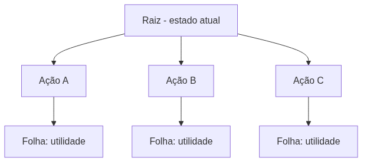

<!-- _class: cover -->

# Inteligência Artificial e Ilusão de Inteligência

## Semana 10 — Minimax e Busca Adversarial

**Módulo 4:** Como derrotar um adversário inteligente?
**Apostila:** Parte V, Cap. 11 (11.1–11.3, 11.6)
**Micro Game:** Board Game AI (início)

---

## Objetivos da aula

Ao final de hoje você será capaz de:

- diferenciar ambientes cooperativos, reativos e competitivos;
- definir jogo de soma zero e a árvore de jogo (raiz, ramos, profundidade, folhas);
- diferenciar utilidade (exata) de função de avaliação (estimada);
- executar manualmente o Minimax em uma árvore pequena;
- reconhecer o efeito horizonte como limitação estrutural.

---

## Retomada — Módulo 3

**Semanas 8–9:** o NPC avaliava e escolhia a própria melhor ação, em ambiente reativo ou cooperativo.

**Hoje:** o ambiente deixa de ser passivo. Um oponente racional planeja **contra** o agente.

Pela primeira vez no semestre, o "ambiente" tem seus próprios objetivos.

---

<!-- _class: question -->

# Como derrotar um adversário inteligente?

Parte 1 — a árvore de jogo e o algoritmo Minimax.

---

## O problema da decisão adversarial

Avaliar uma jogada apenas pelo que ela faz "agora" não basta.

Exemplo: capturar uma peça pode parecer bom e levar a um xeque-mate logo depois.

**Erro comum:** tratar qualquer inimigo desafiador como caso de Minimax, mesmo sem um oponente que alterne decisões com o agente.

---

## Três tipos de ambiente

| Ambiente | Característica | Exemplo de jogo |
|---|---|---|
| Cooperativo | Elementos ajudam o agente | aliado controlado por IA (ex.: Ellie em *The Last of Us*) |
| Reativo | Hostil, mas não planeja contra o agente | inimigo de ação que patrulha e ataque (ex.: *Halo*, *F.E.A.R.*) — Módulos 1 a 3 |
| Competitivo | Oponente planeja contra o agente | xadrez, damas, jogo da velha — **Minimax (hoje)** |

---

## Jogos de soma zero

Em um jogo de soma zero, o ganho de um jogador é exatamente a perda do outro.

Essa propriedade permite ao Minimax usar **uma única** função de valor, medida do ponto de vista de um dos jogadores.

Jogos por turnos, com informação perfeita (ambos veem o estado completo).

---

<!-- _class: diagram -->

## Anatomia da árvore de jogo

Raiz, ramos (ações), nós filhos (estados), níveis alternados, folhas (utilidade).

<!--
FIGURA A PRODUZIR (nota do apresentador — não aparece no slide)

Objetivo didático:
Tornar visível a explosão combinatória da árvore de jogo antes de discutir profundidade e fator de ramificação.
Arquivo sugerido:
assets/arvore-jogo-profundidade.webp
Descrição:
Árvore de jogo com 3 níveis completos, fator de ramificação igual a 3, raiz destacada, folhas numeradas com valores de utilidade.
Como produzir:
Diagrama vetorial produzido em Krita ou Blender (modo 2D), com camadas por profundidade e cor alternada para os níveis MAX e MIN.
-->

---

## Profundidade, *ply* e ramificação

Fator de ramificação **b** e profundidade **d** geram até **b^d** nós.

| Jogo | b aproximado | Consequência |
|---|---|---|
| Jogo da velha | 9 (raiz) | Árvore pequena, exploração completa |
| Xadrez | ~35 | Explosão combinatória inviável |

---

## Utilidade × função de avaliação

| Conceito | Onde se aplica | Natureza |
|---|---|---|
| Utilidade | Folhas (estados terminais) | Valor **exato** |
| Função de avaliação | Nós não-terminais | Valor **estimado** |

Hoje usamos apenas utilidade — o jogo da velha é pequeno o suficiente para ser resolvido por completo.

---

## O algoritmo Minimax

- Nó **MAX**: escolhe o filho de **maior** valor;
- Nó **MIN**: escolhe o filho de **menor** valor;
- A jogada escolhida garante o **melhor resultado no pior caso**.

**Erro comum:** escolher a jogada que leva ao maior valor absoluto da árvore, ignorando que o adversário nunca permitiria alcançá-la.

---

<!-- _class: diagram -->

## Propagação MAX/MIN — exemplo numérico

Jogada A vence (valor 3), mesmo a folha 8 sendo o maior valor da árvore inteira.

---

## Demonstração: Minimax no jogo da velha

A árvore do jogo da velha é pequena — pode ser explorada **até as folhas reais**, sem função de avaliação.

Traçado ao vivo a partir de uma posição intermediária.

---

## Profundidade limitada e horizonte

Jogos maiores que o jogo da velha exigem parar a busca antes das folhas.

Isso gera o **efeito horizonte**: uma limitação estrutural, não um erro de implementação. Será resolvido na Semana 11 com heurísticas e poda alfa-beta.

---

<!-- _class: section -->

# Micro Game Board Game AI — início

Jogo da velha (grade 3×3) com Minimax completo, sem heurística nem poda.

---

## Por que implementação própria em C#

A Unity não oferece um sistema nativo de busca adversarial — é uma ferramenta de propósito geral, voltada a jogos de ação em tempo real.

Minimax é técnica de nicho para jogos de tabuleiro e estratégia por turnos, assim como Utility AI (Módulo 3) já foi implementação própria.

---

## O que implementar hoje

- representação do estado (tabuleiro, jogador da vez, jogadas legais, jogo terminal);
- função recursiva de Minimax, com casos-base de utilidade e alternância MAX/MIN;
- teste jogando manualmente contra a IA;
- justificativa oral da jogada escolhida em posições simples.

---

**Erro comum:** confundir utilidade (valor exato de uma folha) com função de avaliação (estimativa de um nó não-terminal) — nesta semana, apenas utilidade é usada.

---

<!-- _class: exercise -->

# Erro comum

Perder a conta de qual nível da árvore é MAX e qual é MIN durante o traçado manual.

Marcar cada camada com o jogador correspondente antes de propagar valores, usando convenção visual consistente.

---

<!-- _class: summary -->

## Resumo da semana

- Ambiente competitivo exige busca adversarial; cooperativo e reativo, não
- Jogo de soma zero permite uma única função de valor
- Árvore de jogo: raiz, ramos, profundidade, fator de ramificação, folhas
- Utilidade é exata (folhas); função de avaliação é estimada (nós não-terminais)
- Minimax propaga máximo em MAX e mínimo em MIN — melhor resultado no pior caso
- Profundidade limitada gera efeito horizonte, resolvido na Semana 11
- Board Game AI é implementação própria em C#, sem solução oficial da Unity

---

## Preparação para a Semana 11

**Tema:** Heurísticas e Poda Alfa-Beta — encerramento do Módulo 4 e da Unidade IV

- Leitura prévia da Parte V/VI, Cap. 11 e 13 da Apostila
- Traga um jogo maior que o jogo da velha em mente: exploração completa deixará de ser viável

A Semana 11 traz quatro entregas: Micro Game Board Game AI consolidado (50%), AI Design Log (25%), Desafio de Escolha Tecnológica (15%) e 4º momento de Engenharia Reversa (10%).

