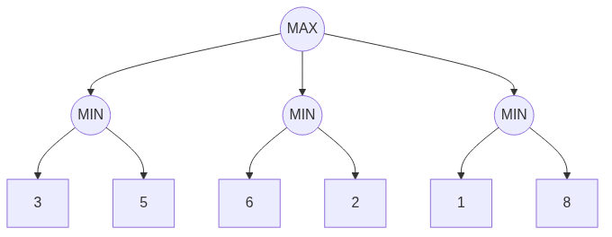

<!-- _class: cover -->


# Inteligência Artificial e Ilusão de Inteligência

## Semana 11 — Heurísticas e Poda Alfa-Beta

<div class="meta">

**Módulo 4:** Como derrotar um adversário inteligente?
**Apostila:** Parte V, Cap. 11 (11.3.4, 11.4, 11.4.1); Parte VI, Cap. 13 (13.1)
**Micro Game:** Board Game AI (consolidação)

</div>

---

## Objetivos da aula

Ao final de hoje você será capaz de:

- diferenciar utilidade (exata) de função de avaliação (estimada);
- construir uma heurística como soma ponderada de características;
- enunciar a condição de poda alfa-beta (α ≥ β);
- executar manualmente a poda sobre uma árvore pequena;
- justificar a importância da ordenação de jogadas.

---

## Retomada da Semana 10

**Semana 10:** Minimax completo resolveu o jogo da velha — árvore pequena o suficiente para explorar até as folhas reais.

**Problema em aberto:** jogos maiores geram explosão combinatória (*b^d*) — a busca completa deixa de ser viável.

<div class="tip">

Hoje: como tornar o Minimax praticável sem abrir mão da qualidade da decisão.

</div>

---

<!-- _class: question -->

# Como derrotar um adversário inteligente?

Parte 2 — heurísticas de avaliação e poda alfa-beta.

---

## Por que parar antes das folhas

Xadrez: *b* ≈ 35. Explorar até o fim é inviável em qualquer orçamento de tempo real.

<div class="warning">

**Erro comum:** achar que o efeito horizonte (Semana 10) é um bug — é uma limitação estrutural da busca em profundidade finita.

</div>

A busca precisa parar em uma **fronteira de profundidade**, antes das folhas reais.

---

## Utilidade × função de avaliação (revisão)

| Conceito | Onde se aplica | Natureza |
|---|---|---|
| Utilidade | Folhas (estados terminais) | Valor **exato** |
| Função de avaliação | Fronteira de profundidade | Valor **estimado** |

A função de avaliação preenche o horizonte quando a busca não alcança folhas reais.

---

## Construindo uma heurística

Soma ponderada de características (*features*) da posição:

```
avaliação = w1·material + w2·centro + w3·segurança_rei + w4·mobilidade
```

Cada peso reflete o quanto aquela característica importa para a qualidade da jogada.

---

<div class="warning">

**Erro comum:** escolher pesos arbitrários, sem justificar a contribuição de cada característica para o comportamento desejado.

</div>

---

## O trade-off precisão × custo

| Heurística | Custo por avaliação | Profundidade alcançável |
|---|---|---|
| Simples | Baixo | Maior |
| Sofisticada | Alto | Menor (mesmo orçamento de tempo) |

<div class="tip">

Heurística melhor pode compensar profundidade menor — não existe escolha "sempre correta".

</div>

---

## Uma ponte com a Parte VI

Funções de avaliação também podem ser **aprendidas a partir de dados**, em vez de ajustadas manualmente — caso do NNUE do Stockfish.

Não é aprofundado hoje: fica como ponte conceitual para os módulos de aprendizagem.

---

<!-- _class: question -->

# Da estimativa à eficiência

A heurística resolve o *o que avaliar*. Falta resolver o *quanto explorar*.

---

## Motivação da poda alfa-beta

Se uma jogada já é comprovadamente pior que uma alternativa conhecida, não é preciso explorá-la até o fim.

<div class="tip">

Analogia: comparando propostas uma a uma, você descarta uma opção assim que sabe que ela não pode vencer a melhor já vista — sem precisar terminar de analisá-la.

</div>

---

## Os valores α e β

- **α:** melhor valor garantido até agora para **MAX**;
- **β:** melhor valor garantido até agora para **MIN**;
- **Condição de poda:** quando **α ≥ β**, o ramo restante pode ser descartado.

---

## Corte alfa × corte beta

| Corte | Ocorre em nó | Condição |
|---|---|---|
| Beta | MAX | valor ≥ β do ancestral MIN |
| Alfa | MIN | valor ≤ α do ancestral MAX |

<div class="warning">

**Erro comum:** trocar corte alfa por corte beta — confundir qual jogador está em cada camada.

</div>

---

<!-- _class: diagram -->

## Retraçando o exemplo A/B/C com poda



Mesma árvore da Semana 10 — agora com α e β anotados a cada passo.

---

> [!FIGURA]
>
> **Objetivo didático**
>
> Mostrar, lado a lado, a árvore completa do Minimax e a mesma árvore com os ramos eliminados pela poda alfa-beta.
>
> **Arquivo sugerido**
>
> ```
> assets/minimax-vs-alfabeta-poda.webp
> ```
>
> **Descrição**
>
> Duas árvores idênticas (jogadas A, B, C; folhas 3/5, 6/2, 1/8): à esquerda, todos os nós visitados; à direita, ramos podados esmaecidos ou tracejados, com valores de α e β anotados nos nós visitados.
>
> **Como produzir**
>
> Diagrama vetorial em Krita ou Blender (modo 2D), reaproveitando a estrutura da árvore da Semana 10, adicionando anotações de α/β e um estilo visual diferenciado para ramos podados.

---

## Corretude da poda

A poda alfa-beta **sempre** produz a mesma jogada que o Minimax completo.

<div class="tip">

Não é uma aproximação: é uma otimização exata. Menos nós são examinados, mas a decisão final não muda.

</div>

---

## Impacto na complexidade

| Caso | Complexidade | Ganho |
|---|---|---|
| Pior caso | O(b^d) | Igual ao Minimax |
| Melhor caso | O(b^{d/2}) | Aproximadamente o dobro da profundidade |

---

## Ordenação de jogadas

A eficácia da poda depende da **ordem** em que os filhos são explorados.

Heurísticas comuns de ordenação: capturas primeiro, tabela de transposição, aprofundamento iterativo, heurísticas *killer* e de histórico.

<div class="warning">

**Erro comum:** implementar a poda sem ordenar jogadas, obter pouco ganho e concluir que "a poda não funciona".

</div>

---

## Ferramentas

Não há solução oficial da Unity para busca adversarial — heurística e poda alfa-beta permanecem **implementação própria em C#**, em continuidade direta com a Semana 10.

---

<!-- _class: exercise -->

# Erro comum

Testar profundidades altas em um tabuleiro maior sem heurística nem poda, tornando a IA lenta demais para uso prático.

<div class="objectives">

Reduzir a profundidade, validar o ganho de desempenho com heurística e poda, e só então aumentá-la novamente.

</div>

---

<!-- _class: section -->

# Micro Game Board Game AI — consolidação

Minimax (Semana 10) + função de avaliação + poda alfa-beta, em tabuleiro maior que o jogo da velha.

---

## O que implementar hoje

- de 2 a 4 características para a função de avaliação, com pesos justificados;
- poda alfa-beta integrada ao Minimax recursivo já implementado;
- teste em tabuleiro maior (ex.: damas simplificada ou Connect Four em grade reduzida);
- comparação do número de nós examinados e do tempo de resposta, com e sem poda.

---

<!-- _class: section -->

# Desafio de Escolha Tecnológica — Módulo 4

Cenário: um jogo de tabuleiro com fator de ramificação bem maior que o jogo da velha, ou com elemento de acaso.

---

## O que é esperado

Avaliar se Minimax com alfa-beta permanece adequado, considerando:

- fator de ramificação e tempo disponível;
- disponibilidade de heurística confiável;
- turnos versus tempo real;
- presença ou não de acaso.

---

<!-- _class: section -->

# 4º Momento de Engenharia Reversa

Jogo sugerido: um **Reversi/Othello** comercial com dificuldade ajustável — caso didático clássico de poda alfa-beta (avaliação por estabilidade de peças e controle de cantos).

---

## Perguntas para observação

- As diferenças de dificuldade sugerem variação na profundidade, na heurística, ou em ambas?
- Há sinais de efeito horizonte em algum nível?
- O tempo de resposta varia com a complexidade da posição, ou é constante?

<div class="industry">

Aplicar os rótulos [Documentado] / [Inferência] / [Especulação] a cada hipótese.

</div>

---

<!-- _class: summary -->

## Resumo da semana

- Função de avaliação estima nós não-terminais na fronteira de profundidade
- Heurística é soma ponderada de características, com trade-off entre precisão e custo
- Poda alfa-beta elimina ramos sem alterar a jogada escolhida do Minimax
- Condição de poda: α ≥ β; corte beta em MAX, corte alfa em MIN
- Melhor caso: O(b^{d/2}), quase o dobro da profundidade no mesmo tempo
- Ordenação de jogadas é decisiva para a eficácia da poda
- Módulo 4 e Unidade IV encerrados: Micro Game, Desafio e Engenharia Reversa entregues

---

## Preparação para a Semana 12

**Tema:** Fundamentos de Algoritmos Genéticos — abertura da Unidade V

- Leitura prévia da Parte VI, Cap. 13 da Apostila, **desde o início** (13.1 a 13.3)
- Nova pergunta: "como encontrar automaticamente boas soluções?" — nova família de técnicas, distinta da busca adversarial

<div class="tip">

O Capítulo 13 será retomado do zero na Semana 12, não continuado a partir da seção 13.1 já vista hoje.

</div>
