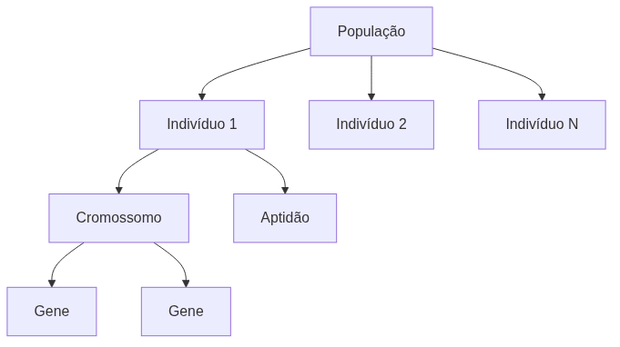
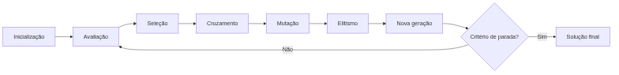
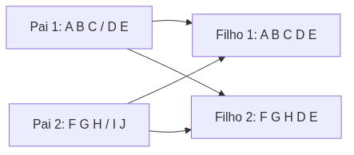

<!-- _class: cover -->

# Inteligência Artificial e Ilusão de Inteligência

## Semana 12 — Fundamentos de Algoritmos Genéticos

**Módulo 5:** Como encontrar automaticamente boas soluções?
**Apostila:** Parte VI, Cap. 13 (13.1 a 13.6)
**Micro Game:** Genetic Lab (início)

---

## Objetivos da aula

Ao final de hoje você será capaz de:

- explicar por que a busca exaustiva é inviável em espaços de otimização;
- diferenciar indivíduo, cromossomo, gene, população e aptidão;
- descrever, em ordem, o ciclo de oito etapas de um Algoritmo Genético;
- avaliar uma representação de cromossomo e uma função de aptidão;
- implementar seleção, crossover, mutação e elitismo em C#.

---

## Retomada da Semana 11

**Semana 11:** heurísticas e poda alfa-beta tornaram o Minimax praticável diante da explosão combinatória (*b^d*) da busca adversarial.

**Unidade IV encerrada:** Módulo 4 e Micro Game Board Game AI consolidados.

A explosão combinatória volta hoje — em um novo tipo de problema.

---

<!-- _class: question -->

# Como encontrar automaticamente boas soluções?

Parte 1 — fundamentos de Algoritmos Genéticos.

---

## Um novo tipo de espaço enorme

Não é mais uma árvore de jogadas — é um espaço de **configurações possíveis** (ex.: parâmetros de uma IA inimiga).

**Erro comum:** achar que Algoritmo Genético e Minimax resolvem o mesmo tipo de problema — um busca a melhor jogada, o outro busca a melhor configuração.

Também aqui a busca exaustiva de todas as combinações é inviável.

---

## Otimização heurística

Buscar uma solução **"boa o suficiente"** em tempo aceitável — não necessariamente a ótima absoluta.

| Já visto | Sentido de "heurística" |
|---|---|
| A* (Módulo 2) | estimar distância até o destino |
| Hoje | estimar/guiar a qualidade de uma solução candidata |

---

## Otimizar × aprender a agir

**Erro comum:** confundir Algoritmo Genético com Aprendizagem por Reforço só porque "ambos melhoram com o tempo".

| Otimização evolutiva (hoje) | Aprendizagem por interação (Módulo 6) |
|---|---|
| Busca a melhor **configuração** em um espaço de candidatos | Ajusta um **comportamento** ao longo de episódios |
| Avalia soluções prontas | Aprende through tentativa e recompensa |

---

<!-- _class: question -->

# Vocabulário evolutivo

Os termos, no sentido computacional.

---

## Indivíduo, cromossomo, gene

- **Indivíduo:** uma solução candidata completa;
- **Cromossomo:** a codificação dessa solução;
- **Gene:** cada componente do cromossomo.

Exemplo: ajustar os parâmetros de uma IA inimiga — cada parâmetro é um gene.

---

## População e aptidão

- **População:** o conjunto de indivíduos avaliados a cada geração;
- **Aptidão (fitness):** o valor que mede quão boa é uma solução.

Seleção natural artificial: soluções mais aptas têm mais chance de gerar descendentes.

---

<!-- _class: diagram -->

## Anatomia de uma população

<!--
FIGURA A PRODUZIR (nota do apresentador — não aparece no slide)

Objetivo didático:
Fixar visualmente a relação entre população, indivíduo, cromossomo, gene e aptidão antes de avançar para o ciclo completo do algoritmo.
Arquivo sugerido:
assets/anatomia-populacao-genetica.webp
Descrição:
Diagrama hierárquico: uma população contendo vários indivíduos; um indivíduo em destaque expandido em seu cromossomo (sequência de genes coloridos); ao lado, um rótulo indicando o valor de aptidão daquele indivíduo.
Como produzir:
Diagrama vetorial em Krita, com blocos retangulares para indivíduos e pequenos quadrados coloridos para genes dentro do cromossomo.
-->

---

<!-- _class: question -->

# O ciclo do Algoritmo Genético

Oito etapas, sempre na mesma ordem.

---

## As oito etapas

1. Inicialização
2. Avaliação
3. Seleção
4. Cruzamento
5. Mutação
6. Elitismo
7. Nova geração
8. Critério de parada

---

<!-- _class: diagram -->

## O ciclo como fluxo

Seleção, cruzamento, mutação e elitismo são os **operadores genéticos** — o "motor" do ciclo.

---

<!-- _class: question -->

# Representação do problema

Como codificar uma solução em cromossomo.

---

## Formas de representação

- **Binária:** sequência de 0s e 1s;
- **Valores reais:** sequência de números (ex.: pesos de uma heurística);
- **Permutação:** uma ordem entre elementos (ex.: rota de entrega);
- **Estruturada:** formatos mais complexos, específicos do problema.

---

**Erro comum:** escolher uma representação em que crossover e mutação, aplicados a cromossomos válidos, produzem com frequência cromossomos **inválidos**.

A representação certa depende do problema — não existe uma única forma correta.

---

<!-- _class: question -->

# Função de aptidão

O único canal de comunicação do objetivo ao algoritmo.

---

## O papel da função de aptidão

A aptidão é a **única forma** de dizer ao algoritmo o que é "bom".

Paralelo direto com a recompensa da Aprendizagem por Reforço (Módulo 6) — mesma ideia de "sinal de objetivo", em famílias de técnicas diferentes.

---

## Quando a função de aptidão falha

| Problema | Efeito |
|---|---|
| Aptidão enganosa | leva a soluções ruins que parecem boas |
| Objetivo mal especificado | algoritmo otimiza a coisa errada |
| Custo de avaliação proibitivo | busca lenta demais na prática |

**Erro comum:** definir uma função de aptidão pouco graduada, em que quase todas as soluções recebem o mesmo valor — a busca fica "cega".

---

<!-- _class: question -->

# Operadores genéticos

Seleção, crossover, mutação, elitismo.

---

## Seleção

| Estratégia | Ideia |
|---|---|
| Roleta | chance proporcional à aptidão |
| Torneio | melhor entre alguns escolhidos ao acaso |
| Ranqueamento | chance baseada na posição no ranking |

Cada uma tem uma vantagem e uma limitação — não existe estratégia sempre superior.

---

## Crossover

- **Um ponto:** corta o cromossomo em uma posição e combina os pais;
- **Múltiplos pontos:** vários cortes;
- **Uniforme:** cada gene vem aleatoriamente de um dos pais.

---

<!-- _class: diagram -->

## Crossover de um ponto

---

## Mutação e elitismo

**Mutação:** altera genes ao acaso, com uma taxa pequena e configurável.

**Erro comum:** taxa de mutação muito alta (busca vira aleatória) ou muito baixa (convergência prematura).

**Elitismo:** preserva o melhor indivíduo entre gerações.

Elitismo em excesso sufoca a diversidade — preservar apenas uma pequena fração da população (ex.: 1 a 5%).

---

## Ferramentas

Não há solução oficial da Unity para Algoritmos Genéticos — implementação **própria em C#**, seguindo o mesmo padrão do Minimax (Módulo 4).

Bibliotecas de terceiros (GeneticSharp, NEAT) ficam para a Semana 13 — não antecipar hoje.

---

<!-- _class: exercise -->

# Erro comum

Tratar Algoritmo Genético e Aprendizagem por Reforço como a mesma coisa, só porque "ambos melhoram com o tempo".

Um busca a melhor configuração em um espaço de candidatos; o outro aprende um comportamento por interação ao longo de episódios.

---

<!-- _class: section -->

# Micro Game Genetic Lab — início

Aplicar seleção, crossover, mutação e elitismo a um problema simples (ex.: aproximar uma string-alvo ou maximizar a soma dos genes — "OneMax").

---

## O que implementar hoje

- população inicial aleatória, com representação adequada ao problema;
- função de aptidão do problema escolhido;
- seleção por torneio, crossover de um ponto, mutação com taxa pequena, elitismo;
- registro da melhor aptidão e da aptidão média ao longo das gerações.

---

<!-- _class: summary -->

## Resumo da semana

- Busca exaustiva é inviável em espaços de configuração enormes — otimização heurística busca "bom o suficiente"
- Vocabulário: indivíduo, cromossomo, gene, população, aptidão
- Ciclo de oito etapas: inicialização, avaliação, seleção, cruzamento, mutação, elitismo, nova geração, critério de parada
- Representação inadequada gera soluções inválidas; função de aptidão mal projetada "cega" a busca
- Operadores genéticos: seleção (roleta/torneio/ranqueamento), crossover (um ponto/múltiplos pontos/uniforme), mutação, elitismo
- Sem entrega formal nesta semana; sem solução oficial da Unity — implementação própria em C#

---

## Preparação para a Semana 13

**Tema:** Aplicação de Algoritmos Genéticos — encerramento da Unidade V

- Confirmar implementação inicial funcional do Genetic Lab, com os quatro operadores identificáveis no código
- Leitura prévia da Parte VI, Cap. 13, seções 13.7 a 13.11 (aplicações, ferramentas de terceiros, vantagens/limitações, estudos de caso)

A Semana 13 aprofunda o problema, discute convergência e diversidade, e traz o 5º momento de Engenharia Reversa.

