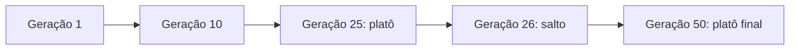

<!-- _class: cover -->


# Inteligência Artificial e Ilusão de Inteligência

## Semana 13 — Aplicação de Algoritmos Genéticos

<div class="meta">

**Módulo 5:** Como encontrar automaticamente boas soluções?
**Apostila:** Parte VI, Cap. 13 (13.7 a 13.11)
**Micro Game:** Genetic Lab (consolidação)

</div>

---

## Objetivos da aula

Ao final de hoje você será capaz de:

- diagnosticar convergência prematura a partir da curva de aptidão;
- relacionar aplicações de Algoritmos Genéticos a problemas de jogos;
- diferenciar implementação própria, GeneticSharp e neuroevolução (NEAT);
- avaliar vantagens e limitações frente a métodos exatos e ao RL;
- consolidar o Micro Game Genetic Lab em um problema mais expressivo.

---

## Retomada da Semana 12

**Semana 12:** vocabulário evolutivo, ciclo de oito etapas, representação, função de aptidão e operadores genéticos — implementação inicial do Genetic Lab em um problema tipo "OneMax".

<div class="tip">

Hoje o problema fica mais expressivo, e o algoritmo genético é colocado à prova.

</div>

---

<!-- _class: question -->

# Como encontrar automaticamente boas soluções?

Parte 2 — convergência, aplicações, ferramentas e limites.

---

## Um problema mais expressivo

Hoje: ajustar um pequeno conjunto de parâmetros de uma IA de jogo, em vez de aproximar uma string ou maximizar uma soma.

<div class="tip">

Mesma representação e mesmos operadores da Semana 12 — a diferença está na complexidade do espaço de busca e da função de aptidão.

</div>

---

<!-- _class: question -->

# Convergência e diversidade

Lendo a curva de aptidão para diagnosticar problemas.

---

## Saltos e platôs

A curva da melhor aptidão ao longo das gerações revela o comportamento da busca.

| Padrão | Leitura |
|---|---|
| Salto | população encontrou uma região melhor |
| Platô curto | busca refinando uma boa solução |
| Platô longo | possível convergência prematura |

---

<!-- _class: diagram -->

## Curva típica de evolução



<div class="warning">

**Erro comum:** insistir nos mesmos parâmetros diante de um platô longo, em vez de ajustar mutação, seleção ou elitismo.

</div>

---

## Diagnosticando convergência prematura

Sinal: platô longo **e** baixa diversidade na população (indivíduos muito parecidos entre si).

Ajustes possíveis:

- aumentar a taxa de mutação;
- reduzir a pressão seletiva (ex.: torneio menor);
- reduzir o grau de elitismo.

---

> [!FIGURA]
>
> **Objetivo didático**
>
> Mostrar visualmente a diferença entre uma população diversa (exploração ativa) e uma população convergida prematuramente (pouca diversidade), lado a lado com suas curvas de aptidão correspondentes.
>
> **Arquivo sugerido**
>
> ```
> assets/convergencia-prematura-vs-diversidade.webp
> ```
>
> **Descrição**
>
> Dois painéis: à esquerda, uma nuvem de pontos dispersa representando indivíduos variados, com uma curva de aptidão em salto; à direita, uma nuvem de pontos concentrada representando indivíduos semelhantes, com uma curva de aptidão em platô longo.
>
> **Como produzir**
>
> Diagrama vetorial em Krita, com dispersão de pontos coloridos para representar indivíduos e um pequeno gráfico de linha anexado a cada painel.

---

<!-- _class: question -->

# Aplicações em jogos

Onde Algoritmos Genéticos aparecem na indústria e na pesquisa.

---

## Cinco famílias de aplicação

- **Balanceamento automático:** ajustar parâmetros de armas, unidades ou cartas;
- **PCG baseada em busca:** gerar fases, mapas ou itens;
- **Evolução de comportamentos:** incluindo neuroevolução;
- **Ajuste de parâmetros de IA:** calibrar heurísticas e pesos;
- **Design procedural interativo:** designer guia a evolução com feedback.

---

<div class="industry">

Cada aplicação reaproveita o mesmo ciclo evolutivo — muda apenas o que é o indivíduo e o que a função de aptidão mede.

</div>

---

<!-- _class: question -->

# Ferramentas

Implementação própria, bibliotecas de terceiros e neuroevolução.

---

## Três caminhos possíveis

| Ferramenta | Natureza | Uso típico |
|---|---|---|
| Implementação própria (C#) | Controle total | Aprendizado, casos simples |
| GeneticSharp | Biblioteca de terceiros | Operadores prontos, produção |
| NEAT (neuroevolução) | Evolui redes neurais | Comportamentos complexos |

<div class="tip">

Nenhuma é solução oficial da Unity — GA permanece fora do ecossistema oficial de IA da engine.

</div>

---

## Neuroevolução como ponte

NEAT evolui a **topologia e os pesos** de uma rede neural — o indivíduo passa a ser uma rede, não um vetor de parâmetros.

<div class="tip">

Ponte conceitual com o Módulo 6: aqui a rede é **evoluída**; no RL, ela é **treinada** por tentativa e recompensa.

</div>

---

<!-- _class: question -->

# Vantagens, limitações e comparação com RL

Avaliação crítica da técnica.

---

## Vantagens

- generalidade — aplica-se a espaços de busca muito diferentes;
- exploração global — robustez a ótimos locais;
- função de aptidão como caixa-preta — não precisa ser diferenciável;
- paralelizável;
- pode produzir soluções criativas, não óbvias.

---

## Limitações

- sem garantia de encontrar o ótimo;
- custo computacional pode ser alto;
- depende criticamente da função de aptidão;
- muitos parâmetros para ajustar;
- risco de convergência prematura;
- velocidade de convergência imprevisível.

---

## Otimizar × aprender a agir (retomada)

| Algoritmo Genético | Aprendizagem por Reforço (Módulo 6) |
|---|---|
| Busca a melhor configuração fixa | Ajusta um comportamento contínuo |
| Avalia soluções prontas | Aprende por tentativa e recompensa |

<div class="warning">

**Erro comum:** propor GA para um problema que exige comportamento adaptativo em tempo real, ou RL para um problema de configuração única.

</div>

---

<!-- _class: question -->

# Estudos de caso

Fato documentado × inferência plausível.

---

## O que se sabe e o que se infere

- PCG baseada em busca: bem documentada na pesquisa acadêmica;
- competições de IA de jogos por evolução, incluindo NEAT;
- balanceamento e ajuste de parâmetros na indústria: inferência cautelosa;
- neuroevolução em jogos experimentais (ex.: NERO).

<div class="warning">

**Erro comum:** afirmar que um jogo comercial específico "usa Algoritmos Genéticos" sem documentação explícita do estúdio.

</div>

---

<!-- _class: exercise -->

# Erro comum

Confundir, no Desafio de Escolha Tecnológica, "otimizar" (GA) com "aprender a agir" (RL), propondo a técnica errada para o problema apresentado.

<div class="objectives">

Verificar: o problema exige uma configuração fixa (otimização) ou um comportamento que se ajusta continuamente (aprendizagem)?

</div>

---

<!-- _class: section -->

# Micro Game Genetic Lab — consolidação

Mesmo ciclo evolutivo da Semana 12, aplicado a um problema mais expressivo.

---

## O que consolidar hoje

- adaptar representação e função de aptidão ao novo problema;
- reexecutar o laço evolutivo, registrando a curva de aptidão;
- diagnosticar sinais de convergência prematura;
- ajustar mutação, seleção ou elitismo, e comparar as curvas.

---

<!-- _class: section -->

# Desafio de Escolha Tecnológica — Módulo 5

Cenário: balancear parâmetros de uma arma, ou gerar variações de uma fase.

---

## O que é esperado

Justificar a solução de otimização escolhida, considerando:

- requisitos do problema;
- alternativas (implementação própria, GeneticSharp, NEAT, ajuste manual);
- limitações de cada abordagem;
- ferramentas disponíveis no contexto do projeto.

---

<!-- _class: section -->

# 5º Momento de Engenharia Reversa

Jogo com balanceamento perceptível entre unidades/cartas/builds, ou com geração procedural de fases/mapas.

---

## Perguntas para observação

- O padrão observado sugere ajuste manual, otimização automática, ou combinação dos dois?
- Que critérios uma função de aptidão precisaria medir para produzir esse resultado?

<div class="industry">

Classificar cada afirmação como [Documentado] ou [Inferência], conforme a seção 13.10.

</div>

---

<!-- _class: summary -->

## Resumo da semana

- Curva de aptidão: saltos indicam progresso, platôs longos com baixa diversidade sinalizam convergência prematura
- Aplicações: balanceamento, PCG, evolução de comportamentos, ajuste de parâmetros, design procedural interativo
- Ferramentas: implementação própria, GeneticSharp (biblioteca) e NEAT (neuroevolução, ponte com o Módulo 6)
- Vantagens: generalidade, exploração global, robustez a ótimos locais, paralelização
- Limitações: sem garantia de ótimo, custo computacional, dependência da função de aptidão
- GA otimiza uma configuração; RL aprende um comportamento — famílias distintas
- Módulo 5 e Unidade V encerrados: Micro Game, Desafio e Engenharia Reversa entregues

---

## Preparação para a Semana 14

**Tema:** Abertura da Unidade VI — Aprendizagem e Adaptação

- Leitura prévia da Parte VI, Cap. 12 da Apostila (Aprendizagem por Reforço)
- Antecipar a instalação do ambiente ML-Agents (Python e pacotes)

<div class="tip">

Nova pergunta: "como um agente aprende?" — retomando a distinção entre otimizar (GA, Módulo 5) e aprender a agir (RL, Módulo 6).

</div>
