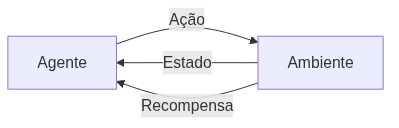

<!-- _class: cover -->

# Inteligência Artificial e Ilusão de Inteligência

## Semana 14 — Fundamentos de Aprendizagem por Reforço

**Módulo 6:** Como um agente aprende?
**Apostila:** Parte VI, Cap. 12 (12.1 a 12.5, e 12.9 como contextualização)
**Micro Game:** Adaptive AI (início — planejamento e setup)

---

## Objetivos da aula

Ao final de hoje você será capaz de:

- distinguir programação explícita de aprendizado pela interação;
- definir o vocabulário fundamental do RL: agente, ambiente, estado, ação, recompensa, episódio, política;
- explicar o ciclo de aprendizagem e o retorno com desconto (γ);
- relacionar o MDP e a propriedade de Markov a um bom estado;
- diferenciar valor de estado V(s) e valor de ação Q(s, a).

---

## Retomada da Semana 13

**Semana 13:** encerramento do Módulo 5 — Algoritmos Genéticos, convergência, aplicações e ferramentas (GeneticSharp, NEAT).

Hoje abrimos o Módulo 6 e a Unidade VI: uma nova família de problemas — agentes que aprendem pela interação.

---

<!-- _class: question -->

# Como um agente aprende?

Parte 1 — vocabulário, ciclo de aprendizagem e fundamentos matemáticos.

---

## O problema

Alguns comportamentos são difíceis de programar à mão — equilibrar-se, perseguir um alvo em terreno irregular, adaptar-se a um oponente imprevisível.

RL propõe outro caminho: em vez de codificar a regra, o agente **aprende** a política pela interação com o ambiente.

---

## RL não é aprendizado supervisionado

| Aprendizado Supervisionado | Aprendizagem por Reforço |
|---|---|
| Exemplos rotulados (entrada → saída correta) | Nenhum "gabarito" de ações |
| Erro medido diretamente | Apenas um sinal de recompensa, esparso e atrasado |
| Aprende a imitar | Aprende a agir por tentativa e erro |

---

<!-- _class: diagram -->

## O laço agente–ambiente

O agente observa o estado, escolhe uma ação, recebe uma recompensa e um novo estado — o ciclo se repete a cada passo.

---

## Vocabulário fundamental

- **Agente:** quem decide e age;
- **Ambiente:** tudo com que o agente interage;
- **Estado:** a representação da situação atual;
- **Ação:** o que o agente pode fazer;
- **Recompensa:** sinal numérico de retorno imediato;
- **Episódio:** uma sequência completa até um estado terminal;
- **Política:** a regra que mapeia estado → ação.

---

**Erro comum:** projetar a recompensa para o meio (a ação desejada) em vez do fim (o resultado desejado) — risco de *reward hacking*, como no caso documentado do jogo *CoastRunners*.

---

## Exploração *versus* exploitation

Um agente que só explora nunca converge; um agente que só faz *exploitation* pode travar em um ótimo local.

Estratégia comum: **ε-greedy** — na maior parte do tempo escolhe a melhor ação conhecida, mas ocasionalmente explora ao acaso.

---

## O ciclo de aprendizagem em cinco etapas

1. **Observar** o estado atual;
2. **Decidir** uma ação (política atual);
3. **Agir** no ambiente;
4. **Receber** a recompensa e o novo estado;
5. **Atualizar** a política com base no resultado.

---

## Retorno acumulado e desconto (γ)

O agente não maximiza apenas a recompensa imediata, mas o **retorno** — a soma das recompensas futuras, ponderada por um fator de desconto γ (0 ≤ γ ≤ 1).

γ próximo de 1: o agente valoriza recompensas distantes. γ próximo de 0: o agente é "imediatista".

---

<!-- _class: question -->

# Processo de Decisão de Markov (MDP)

Formalizando o cenário de decisão.

---

## Estados, ações, transições, recompensas

Um MDP formaliza o problema como: **estados**, **ações** disponíveis, **transições** entre estados e **recompensas** associadas.

**Propriedade de Markov:** o estado deve conter tudo o que é relevante para decidir — o futuro não pode depender do histórico, só do estado atual. É uma hipótese de projeto, não uma garantia automática.

---

## Um bom estado é uma escolha de projeto

Omitir velocidade ou direção quando são relevantes pode violar a propriedade de Markov — o agente perde informação necessária para decidir bem.

Pergunta de verificação: para cada observação omitida, ela poderia ser necessária para a decisão?

---

<!-- _class: question -->

# Função valor: V(s) e Q(s, a)

Diferenciando recompensa de valor.

---

## Recompensa imediata × valor de longo prazo

- **Recompensa:** o sinal recebido em um único passo;
- **Valor de estado V(s):** o retorno esperado a partir de um estado;
- **Valor de ação Q(s, a):** o retorno esperado ao tomar a ação *a* no estado *s*.

Paralelo já conhecido: Q(s, a) cumpre papel semelhante ao da função de avaliação do Minimax (Módulo 4) e do mapa de influência (Módulo 3) — reduz a decisão a "escolher o maior valor".

---

**Erro comum:** confundir valor com recompensa, avaliando decisões apenas pelo ganho imediato — uma ação pode ter recompensa baixa e valor alto (ou o inverso).

---

<!-- _class: section -->

# ML-Agents — contextualização de ferramenta

Sem configuração de treinamento nesta semana.

---

## O que o ML-Agents faz

O ML-Agents é a ferramenta oficial da Unity que materializa o vocabulário do RL na engine:

- observações, ações e recompensa são definidas em C#;
- o treinamento roda em Python;
- a política treinada é executada na Unity via **Sentis**.

Nesta semana: apenas contextualização. Nenhum componente de ML-Agents será configurado.

<!--
FIGURA A PRODUZIR (nota do apresentador — não aparece no slide)

Objetivo didático:
Ilustrar o laço agente–ambiente do ML-Agents dentro de uma cena Unity, conectando o vocabulário teórico (agente, ambiente, observação, ação, recompensa) aos elementos visuais de uma cena real.
Arquivo sugerido:
assets/laco-agente-ambiente-mlagents.webp
Descrição:
Uma cena Unity simplificada mostrando um agente (cubo ou cápsula) em um ambiente com um alvo e obstáculos, com setas indicando observação → decisão → ação → recompensa em ciclo.
Como produzir:
Captura de tela de uma cena mínima montada no Unity, com anotações (setas e rótulos) adicionadas em Krita.
-->

---

Exemplos oficiais do ML-Agents (Walker, Crawler) mostram criaturas aprendendo a caminhar pela interação — sem nenhuma regra de locomoção programada à mão.

---

<!-- _class: section -->

# Micro Game Adaptive AI — planejamento

Antes de treinar, é preciso planejar.

---

## O que planejar hoje

Sem configurar ML-Agents ainda, cada grupo define, por escrito:

- o **estado** (quais observações o agente terá);
- o **espaço de ações** disponível (discretas ou contínuas);
- a **função de recompensa** planejada.

Verificar: o estado escolhido respeita a propriedade de Markov? A recompensa premia o resultado desejado, e não apenas a ação?

---

## Cenário mínimo na Unity

Montar o cenário do Adaptive AI com elementos primitivos simples (cubos, esferas, planos): agente, ambiente, alvo ou obstáculos.

Nenhum componente de ML-Agents é configurado nesta semana — o cenário fica pronto para receber o treinamento na Semana 15.

---

<!-- _class: exercise -->

# Erro comum

Tentar, por entusiasmo, configurar ou treinar o ML-Agents nesta semana, antecipando a Semana 15.

Esta semana é de planejamento conceitual — a configuração técnica será conduzida com cuidado na próxima aula.

---

<!-- _class: summary -->

## Resumo da semana

- RL: aprender pela interação, não por exemplos rotulados
- Vocabulário: agente, ambiente, estado, ação, recompensa, episódio, política
- Ciclo de cinco etapas e retorno acumulado com desconto γ
- MDP e propriedade de Markov: um bom estado é uma escolha de projeto
- V(s) e Q(s, a): valor ≠ recompensa imediata
- ML-Agents apresentado como ferramenta — sem treinamento ainda
- Micro Game Adaptive AI: planejamento de estado, ações e recompensa

---

## Preparação para a Semana 15

**Tema:** Treinamento com ML-Agents

- Leitura prévia da seção 12.6 (Q-Learning) e, se possível, 12.9 completa
- Antecipar a instalação do ambiente ML-Agents (Python e pacotes)

Trazer o planejamento validado de estado, ações e recompensa — ele será operacionalizado na Semana 15.

