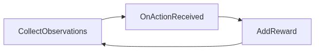

<!-- _class: cover -->


# Inteligência Artificial e Ilusão de Inteligência

## Semana 15 — Treinamento com ML-Agents

<div class="meta">

**Módulo 6:** Como um agente aprende?
**Apostila:** Parte VI, Cap. 12, seção 12.6 (Q-Learning) e seção 12.9 (ML-Agents)
**Micro Game:** Adaptive AI (treinamento efetivo)

</div>

---

## Objetivos da aula

Ao final de hoje você será capaz de:

- calcular a atualização de uma célula Q(s, a) com a equação de Bellman;
- explicar por que uma rede neural substitui a tabela Q em espaços grandes;
- configurar os componentes básicos de um agente treinável no ML-Agents;
- interpretar a curva de recompensa de um treinamento em andamento.

---

## Retomada da Semana 14

**Semana 14:** vocabulário do RL (agente, ambiente, estado, ação, recompensa), MDP, propriedade de Markov, V(s) e Q(s, a). Planejamento do Adaptive AI, sem configurar ferramentas.

<div class="tip">

Hoje o planejamento vira código: o agente será treinado de verdade.

</div>

---

<!-- _class: question -->

# Como um agente aprende?

Parte 2 — Q-Learning, treinamento e leitura da curva de recompensa.

---

## A tabela Q

Uma forma concreta de guardar Q(s, a): uma tabela com um estado por linha e uma ação por coluna.

<div class="tip">

Decidir vira simples: em cada estado, escolher a ação da coluna com maior valor.

</div>

---

## O limite da tabela

A tabela Q exige uma linha para **cada** estado possível.

<div class="warning">

Em espaços de estado grandes ou contínuos (posição, velocidade, ângulo), o número de linhas explode — a tabela deixa de ser viável.

</div>

---

## A equação de Bellman

```
Q(s,a) ← Q(s,a) + α·[r + γ·maxₐ′Q(s′,a′) − Q(s,a)]
```

- **r:** recompensa imediata
- **γ·maxₐ′Q(s′,a′):** melhor valor futuro estimado
- **α:** taxa de aprendizagem — quanto o novo valor pesa sobre o antigo

---

## Exemplo — trilha S1 a S5

Uma trilha linear de cinco estados; recompensa só ao alcançar S5.

<div class="tip">

A cada atualização, parte do valor da recompensa terminal "escorre" para trás, de Q(S4,→) até Q(S1,→) — é assim que o agente aprende a valorizar estados distantes do objetivo.

</div>

---

<div class="error">

**Erro comum:** tratar cada atualização de Q(s, a) como definitiva. Na prática, o valor se ajusta aos poucos, por muitas repetições da mesma transição.

</div>

---

## Da tabela à rede neural

Se a tabela não cabe, algo precisa **aproximar** a função Q — esse algo é uma rede neural.

<div class="tip">

O PPO, algoritmo do ML-Agents, resolve o mesmo problema do Q-Learning (estimar valor/política) por um caminho diferente: aproximação em vez de tabela.

</div>

---

<!-- _class: section -->

# ML-Agents — da teoria ao componente

Configurando o agente do Adaptive AI.

---

## Três componentes na cena

- **Agent (C#):** implementa observações, ações e recompensa;
- **Behavior Parameters:** define o formato de entrada/saída da política;
- **Decision Requester:** solicita decisões em intervalos regulares.

---

<!-- _class: diagram -->

## Do vocabulário ao código



Estado → ação → recompensa, o mesmo ciclo da Semana 14, agora em métodos C#.

<!--
FIGURA A PRODUZIR (nota do apresentador — não aparece no slide)

Objetivo didático:
Mostrar a correspondência entre o planejamento de estado/ação/recompensa da Semana 14 e os componentes reais do ML-Agents na cena do Adaptive AI.
Arquivo sugerido:
assets/componentes-mlagents-adaptive-ai.webp
Descrição:
Captura do Inspector da Unity mostrando um GameObject com os componentes Agent, Behavior Parameters e Decision Requester configurados, com anotações apontando para cada um.
Como produzir:
Captura de tela direta da cena montada na Semana 14, com anotações adicionadas em Krita.
-->

---

## Hiperparâmetros básicos

| Hiperparâmetro | Efeito qualitativo |
|---|---|
| Taxa de aprendizagem | Passos maiores ou menores na atualização da política |
| Tamanho de lote | Estabilidade da estimativa a cada atualização |
| Unidades ocultas | Capacidade da rede para representar a política |
| Passos máximos | Duração total do treinamento |

---

<!-- _class: section -->

# Laboratório — treinamento efetivo

Da configuração à curva de recompensa.

---

## O que fazer hoje

1. Configurar o YAML com os hiperparâmetros básicos;
2. iniciar o treinamento via linha de comando;
3. acompanhar a curva de recompensa no TensorBoard;
4. registrar o modelo `.onnx` gerado ao final.

---

## Lendo a curva de recompensa

<div class="warning">

Curva subindo de forma gradual: aprendizado em progresso. Curva estagnada ou instável: sinal de problema a diagnosticar.

</div>

Três suspeitos mais prováveis: recompensa mal especificada, estado insuficiente, hiperparâmetros inadequados.

---

<div class="industry">

Nos exemplos oficiais do ML-Agents (Walker, Crawler), a curva de recompensa sobe de forma gradual ao longo de milhares de passos — não em minutos.

</div>

---

<!-- _class: exercise -->

# Erro comum

Esperar que o agente aprenda de forma visível em poucos minutos, ou confundir treinar (ML-Agents) com executar (Sentis, Semana 16).

<div class="objectives">

Treinamento é um processo gradual e monitorado — não um resultado instantâneo.

</div>

---

<!-- _class: summary -->

## Resumo da semana

- Tabela Q: estrutura, decisão e limite de escala
- Equação de Bellman e exemplo da trilha S1–S5
- Rede neural como substituta da tabela em espaços grandes
- Componentes do ML-Agents: Agent, Behavior Parameters, Decision Requester
- Hiperparâmetros básicos de treinamento
- Treinamento efetivo do Adaptive AI e leitura da curva de recompensa

---

## Preparação para a Semana 16

**Tema:** Inferência com Sentis e consolidação

- Preservar o modelo `.onnx` e a curva de recompensa registrada
- Leitura prévia da seção 12.9 (parte de inferência)

<div class="tip">

Semana 16 encerra o Módulo 6 com quatro entregas: Adaptive AI consolidado (50%), AI Design Log (25%), Desafio de Escolha Tecnológica (15%) e Engenharia Reversa (10%).

</div>
