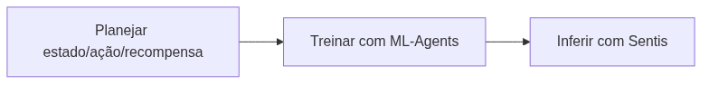

<!-- _class: cover -->

# Inteligência Artificial e Ilusão de Inteligência

## Semana 16 — Inferência com Sentis e consolidação

**Módulo 6:** Como um agente aprende?
**Apostila:** Parte VI, Cap. 12, seções 12.9 a 12.11
**Micro Game:** Adaptive AI — Coletor de Recompensas (consolidação final)

---

## Objetivos da aula

Ao final de hoje você será capaz de:

- distinguir claramente treinar (ML-Agents) de executar (Sentis);
- importar um modelo `.onnx` e configurar a inferência no Sentis;
- executar o Adaptive AI de forma autônoma, sem o ambiente Python;
- justificar tecnicamente o uso de RL frente a alternativas mais simples.

---

## Retomada da Semana 15

**Semana 15:** Q-Learning, equação de Bellman, componentes do ML-Agents e treinamento efetivo do Adaptive AI, com acompanhamento da curva de recompensa.

Hoje o modelo treinado sai do laboratório e entra em execução.

---

<!-- _class: question -->

# Como um agente aprende?

Parte 3 — da política em treino ao modelo executando no jogo.

---

## O ciclo do Módulo 6

Cada semana resolveu uma etapa deste ciclo. Hoje ele se fecha.

---

## Treinar × Executar

| | ML-Agents | Sentis |
|---|---|---|
| **Etapa** | Treinamento | Inferência |
| **Ambiente** | Python + Unity | Apenas Unity |
| **Saída/Entrada** | Gera o modelo `.onnx` | Consome o modelo `.onnx` |

Um jogo publicado nunca carrega o ambiente de treinamento — apenas o modelo já pronto.

---

## O que é o Sentis

Motor oficial da Unity para inferência de redes neurais dentro do próprio jogo, sem dependência externa.

O Sentis não treina. Ele apenas executa uma política já aprendida.

No Package Manager, o pacote pode aparecer como "Inference Engine" (`com.unity.ai.inference`) em vez de "Sentis", dependendo da versão — buscar pelo identificador.

---

<!-- _class: section -->

# Do treinamento à execução

Importando e configurando o modelo no Adaptive AI.

---

## Três passos da inferência

1. Importar o arquivo `.onnx` (gerado na Semana 15) como asset do Sentis;
2. configurar o componente de inferência (worker) na cena;
3. substituir o vínculo com o Decision Requester pela leitura direta do modelo.

<!--
FIGURA A PRODUZIR (nota do apresentador — não aparece no slide)

Objetivo didático:
Mostrar a substituição do vínculo de treinamento (ML-Agents) pelo componente de inferência do Sentis na mesma cena do Adaptive AI.
Arquivo sugerido:
assets/inferencia-sentis-adaptive-ai.webp
Descrição:
Captura do Inspector da Unity mostrando o GameObject do agente com o componente de inferência do Sentis configurado, com o asset `.onnx` importado visível no Project.
Como produzir:
Captura de tela direta da cena do Adaptive AI após a configuração do Sentis, com anotações adicionadas em Krita.
-->

---

<!-- _class: section -->

# Laboratório — consolidação

Executando o Adaptive AI de ponta a ponta.

---

## O que fazer hoje

1. Importar o próprio modelo `.onnx` no Sentis;
2. configurar a inferência na cena do Adaptive AI — Coletor de Recompensas;
3. executar e observar o agente coletando itens positivos e evitando negativos, sozinho;
4. comparar com o comportamento visto no treinamento (Semana 15).

---

**Erro comum:** tentar re-treinar o modelo dentro do Sentis. Qualquer ajuste de comportamento exige voltar ao ML-Agents.

---

## Vantagens e limitações do RL

**Vantagem:** gera comportamento emergente, difícil de scriptar manualmente.

**Limitação:** alto custo de treinamento, comportamento imprevisível, depuração difícil.

---

Estúdios costumam reservar RL para casos onde soluções determinísticas (FSM, Utility AI) não capturam bem o comportamento desejado — não como escolha padrão.

---

<!-- _class: exercise -->

# Desafio de Escolha Tecnológica (M6)

Cenário: um oponente deve ajustar sua estratégia ao estilo de jogo do usuário.

Justifiquem: ML-Agents/Sentis ou uma alternativa mais simples (Utility AI, FSM)? Considerem requisitos, limitações e ferramentas disponíveis.

---

## Engenharia Reversa — 6º momento

Jogo comercial com IA adaptativa ou aprendizado perceptível pelo jogador.

Aprendizagem real (rede treinada) ou heurística adaptativa simples? Que evidências sustentam a hipótese?

---

## Encerramento do ciclo dos seis módulos

| Módulo | Pergunta | Micro Game |
|---|---|---|
| 1 | Como um NPC decide o que fazer? | NPC Decision — Criatura de Ambiente |
| 2 | Como um agente encontra seu destino? | Navigation — Entregador |
| 3 | Como um NPC escolhe sua melhor ação? | Tactical AI — Seleção de Alvo |
| 4 | Como derrotar um adversário inteligente? | Board Game AI — Conecta 4 Reduzido |
| 5 | Como encontrar automaticamente boas soluções? | Genetic Lab — Criaturas Evoluídas |
| 6 | Como um agente aprende? | Adaptive AI — Coletor de Recompensas |

Seis perguntas, seis famílias de técnicas, um único AI Playground. Semana 17: reunir tudo.

---

<!-- _class: summary -->

## Resumo da semana

- Distinção treinar (ML-Agents) × executar (Sentis)
- Importação do modelo `.onnx` e configuração da inferência
- Vantagens e limitações do RL frente a técnicas determinísticas
- Módulo 6 encerrado com quatro entregas: Adaptive AI consolidado (50%), AI Design Log (25%), Desafio de Escolha Tecnológica (15%) e 6º momento de Engenharia Reversa (10%)

---

## Preparação para a Semana 17

**Tema:** Engenharia Reversa integrada e apresentação final do AI Playground

- Reunir e testar todos os Micro Games (Módulos 1 a 6)
- Leitura prévia da Parte VII, Cap. 15 (Estudos de Caso Comentados)

Semana 17 encerra o semestre: apresentação final e AI Design Log consolidado.

