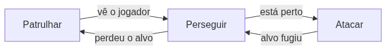

<!-- _class: cover -->

# Inteligência Artificial e Ilusão de Inteligência

## Semana 2 — Máquinas de Estado Finitas

**Módulo 1:** Como um NPC decide o que fazer?
**Apostila:** Parte II, Cap. 3
**Micro Game:** NPC Decision

---

## Objetivos da aula

Ao final de hoje você será capaz de:

- explicar por que condicionais soltos não bastam para decidir;
- definir estado, transição, evento e ação;
- aplicar o ciclo enter/update/exit;
- distinguir FSM por polling de FSM por eventos;
- implementar uma primeira FSM no Micro Game NPC Decision.

---

## Retomada da Semana 1

O ciclo **Sentir → Pensar → Agir** é o modelo de todo agente.

Hoje aprofundamos a etapa **Pensar**: como organizar a decisão do NPC ao longo do tempo.

---

<!-- _class: question -->

# Como um NPC decide o que fazer?

Um guarda ouve um ruído, investiga, e depois volta a patrulhar. Como isso é "lembrado"?

---

## O problema dos condicionais soltos

Uma cadeia de `if/else` reavaliada a cada quadro **não tem memória de contexto**.

O guarda esquece que estava investigando assim que o ruído para — e volta a patrulhar cedo demais.

---

## A resposta: Máquina de Estados Finita

Um NPC está sempre em **um único estado**, e só muda de estado por uma transição explícita.

- Isso **é** a memória de contexto que faltava
- Base teórica: **autômatos finitos**

---

## Os quatro conceitos elementares

| Conceito | O que representa |
|---|---|
| **Estado** | Um modo de comportamento (ex.: Patrulhar) |
| **Transição** | Mudança de um estado para outro |
| **Evento / Guarda** | Condição que dispara a transição |
| **Ação** | O que o NPC faz dentro do estado |

---

<!-- _class: diagram -->

## Exemplo: três estados

---

## Guardas de transição e prioridade

Duas guardas podem ser verdadeiras ao mesmo tempo.

"Distância < 2m" e "vida < 10%" — qual vence? A prioridade precisa ser definida conscientemente, não por acidente de ordem no código.

---

## Funcionamento: polling vs. eventos

- **Polling** — a condição é checada a cada quadro
- **Eventos** — a transição é disparada apenas quando algo muda

Polling é mais simples de implementar; eventos custam menos processamento quando a condição raramente muda.

---

## O ciclo enter / update / exit

Cada estado tem três momentos distintos.

| Momento | Quando ocorre | Exemplo |
|---|---|---|
| **Enter** | Uma vez, ao entrar | Tocar som de alerta |
| **Update** | A cada quadro, enquanto permanece | Mover em direção ao alvo |
| **Exit** | Uma vez, ao sair | Parar animação de perseguição |

Erro comum: colocar o som de alerta no *update* — ele toca a cada quadro, não uma vez só.

---

## Exemplo canônico: o guarda de 5 estados

Patrulhar → Investigar → Perseguir → Atacar → Fugir

Cada seta é uma transição guardada por uma condição específica.

---

## FSM no Unity: Animator Controller

O Animator materializa visualmente os conceitos estudados.

| Conceito teórico | Elemento no Animator |
|---|---|
| Estado | Nó do grafo |
| Transição | Seta entre nós |
| Guarda | Parâmetro (bool, float, trigger) |

<!--
FIGURA A PRODUZIR (nota do apresentador — não aparece no slide)

Objetivo didático:
Mostrar a correspondência direta entre os conceitos de FSM estudados e os elementos visuais do Animator Controller.
Arquivo sugerido:
assets/animator-fsm-guarda.webp
Descrição:
Captura de tela do Animator Controller da Unity com três estados (Patrulhar, Perseguir, Atacar) conectados por setas rotuladas com os parâmetros de guarda correspondentes.
Como produzir:
Screenshot direto do editor Unity durante a demonstração ao vivo, com anotações simples adicionadas no Krita.
-->

---

## Aplicações em jogos comerciais

- **Pac-Man (1980)** — fantasmas com estados *chase*, *scatter*, *frightened*
- **Half-Life (1998)** — esquadrões de soldados coordenados por FSM

A FSM continua presente mesmo em jogos modernos, geralmente como camada de baixo nível dentro de estruturas maiores.

---

<!-- _class: section -->

# Implementação guiada

Construindo a primeira versão do Micro Game NPC Decision.

---

## Do esboço à FSM

Retome o esboço da Semana 1 e defina, em grupo:

1. de três a cinco estados;
2. as transições entre eles;
3. a prioridade entre guardas concorrentes.

---

## Implementação no Unity

Três caminhos possíveis, conforme o domínio do grupo:

- **Animator Controller** — mais visual
- **Script com `enum`/`switch`** — mais direto
- **Padrão de projeto *State*** — mais extensível

O conceito avaliado é o mesmo nas três abordagens.

---

<!-- _class: exercise -->

# Erro comum

Tentar implementar já na primeira versão um número excessivo de estados.

Mantenha o escopo entre três e cinco estados — o suficiente para observar o comportamento sem antecipar a explosão de transições.

---

## Discussão técnica: os limites da FSM plana

E se adicionarmos "Esconder-se" e "Chamar reforços" ao guarda?

O número de transições possíveis cresce de forma quadrática com o número de estados — a explosão de transições.

---

<!-- _class: summary -->

## Resumo da semana

- FSM resolve a falta de memória de contexto dos condicionais soltos
- Estado, transição, evento e ação são os quatro conceitos elementares
- O ciclo enter/update/exit evita ações repetidas por engano
- O Animator Controller materializa a FSM visualmente na Unity
- Uma FSM plana com muitos estados sofre explosão de transições

---

## Preparação para a Semana 3

**Tema:** Máquinas de Estado Hierárquicas

- Ler o Capítulo 4 da Apostila
- Trazer a FSM implementada hoje, funcionando no Micro Game

Pergunta que abre a Semana 3: como organizar uma FSM que já apresenta sinais de explosão de transições?

