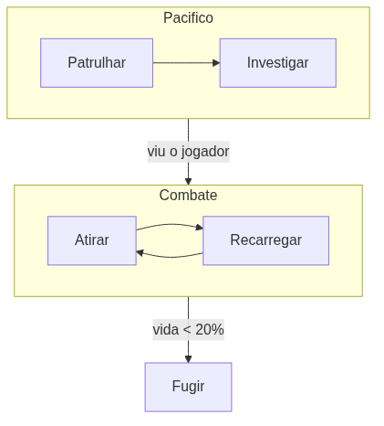

<!-- _class: cover -->

# Inteligência Artificial e Ilusão de Inteligência

## Semana 3 — Máquinas de Estado Hierárquicas

**Módulo 1:** Como um NPC decide o que fazer?
**Apostila:** Parte II, Cap. 4
**Micro Game:** NPC Decision

---

## Objetivos da aula

Ao final de hoje você será capaz de:

- explicar o problema resolvido pela HFSM;
- definir superestado, subestado e configuração ativa;
- explicar a herança de transições por avaliação em cascata;
- diferenciar histórico raso de histórico profundo;
- reestruturar a FSM da Semana 2 em uma HFSM.

---

## Retomada da Semana 2

Uma FSM plana organiza a decisão do NPC em estados, transições, eventos e ações.

Mas o que acontece quando o número de estados cresce?

---

<!-- _class: question -->

# Como organizar decisões cada vez mais complexas de um NPC?

O guarda agora tem cinco estados de combate. Todos precisam da regra "vida < 20% → Fugir". E agora?

---

## O problema: redundância de regras comuns

Não é só o número de transições — é a **mesma regra repetida** em cada estado de combate.

Cinco estados de combate, cinco cópias da regra "vida < 20% → Fugir". Mudar a regra significa editar cinco lugares.

---

## A resposta: Máquina de Estados Hierárquica

Estados podem conter **submáquinas** — uma hierarquia de superestados e subestados.

- A regra comum sobe para a borda do superestado
- Passa a valer para todos os subestados internos

---

## Os conceitos elementares da HFSM

| Conceito | O que representa |
|---|---|
| **Superestado** | Agrupa subestados relacionados (ex.: Combate) |
| **Subestado** | Estado interno de um superestado (ex.: Atirar) |
| **Configuração ativa** | Pilha de estados ativos (ex.: Combate → Atirar) |
| **Estado inicial** | Subestado padrão ao entrar em cada nível |

---

<!-- _class: diagram -->

## Exemplo: dois superestados

---

## Herança de transições

A avaliação ocorre **em cascata**: primeiro o superestado, depois o subestado ativo.

Se a regra do superestado dispara, o subestado interno nem chega a ser avaliado — por isso ela vale para todos.

---

## Ordem correta de enter/exit

Transições que cruzam níveis disparam enter/exit em **cada nível atravessado**.

Erro comum: sair de "Atirar" direto para "Fugir" sem disparar o *exit* do superestado Combate — inicializações ficam pendentes.

---

## Estado de histórico

Ao reentrar em um superestado, retomar o subestado onde parou ou reiniciar pelo inicial?

| Tipo | Comportamento |
|---|---|
| **Histórico raso** | Retoma o subestado do nível imediato |
| **Histórico profundo** | Retoma toda a configuração ativa aninhada |

---

## Quando usar histórico?

Um guarda interrompido em "Recarregando" deve retomar dali — não reiniciar do zero ao voltar ao combate.

Histórico aplicado sem critério produz comportamento "grudento" onde reiniciar seria mais natural.

---

## HFSM no Unity: sub-state machines

O Animator materializa a hierarquia diretamente.

| Conceito teórico | Elemento no Animator |
|---|---|
| Superestado | Sub-state machine |
| Subestado | Estado interno da sub-state machine |
| Transição herdada | Seta que sai da borda da sub-state machine |

<!--
FIGURA A PRODUZIR (nota do apresentador — não aparece no slide)

Objetivo didático:
Mostrar a correspondência entre superestado/subestado e a sub-state machine do Animator.
Arquivo sugerido:
assets/animator-hfsm-guarda.webp
Descrição:
Captura de tela do Animator Controller com uma sub-state machine "Combate" contendo os estados "Atirar" e "Recarregar", e uma transição saindo da borda da sub-state machine para "Fugir".
Como produzir:
Screenshot direto do editor Unity durante a demonstração ao vivo, com anotações simples adicionadas no Krita.
-->

---

## O que a HFSM não resolve

A hierarquia organiza a complexidade, mas o acoplamento entre estados e a rigidez estrutural da família FSM permanecem.

Comportamento sequenciado e reordenável ainda é difícil — problema em aberto para a Semana 4.

---

<!-- _class: section -->

# Implementação guiada

Reestruturando a FSM da Semana 2 em HFSM.

---

## Passo a passo

1. Revisar a FSM da Semana 2 e listar estados que compartilham transições de saída;
2. Definir ao menos dois superestados coerentes;
3. Migrar as transições comuns para a borda de cada superestado;
4. Decidir, superestado por superestado, o uso de histórico.

---

## Implementação no Unity

Duas abordagens possíveis, conforme a implementação da Semana 2:

- **Sub-state machines do Animator** — mais visual
- **Extensão do padrão *State* em C#** — estados que contêm submáquinas

O comportamento observável não muda — o ganho é de organização.

---

<!-- _class: exercise -->

# Erro comum

Escolher superestados de forma arbitrária, sem que os estados agrupados compartilhem transições.

Pergunta-chave: "há um conjunto de estados que compartilha as mesmas transições de saída?" Se não, reconsidere o agrupamento.

---

## Discussão técnica: FSM plana versus HFSM

Compare o número de transições escritas antes e depois da reestruturação.

O que ainda seria trabalhoso reordenar ou reutilizar nesta HFSM? Essa pergunta abre caminho para a Semana 4.

---

<!-- _class: summary -->

## Resumo da semana

- HFSM resolve a redundância de regras repetidas na FSM plana
- Superestado, subestado e configuração ativa organizam a hierarquia
- Transições herdadas surgem da avaliação em cascata
- Histórico raso e profundo decidem se o NPC retoma ou reinicia
- Acoplamento e rigidez estrutural permanecem sem solução

---

## Preparação para a Semana 4

**Tema:** Árvores de Comportamento, Blackboard e Engenharia Reversa

- Ler o Capítulo 6 da Apostila (Árvores de Comportamento) e o Capítulo 14 (Engenharia Reversa)
- Trazer a HFSM funcional implementada hoje, no Micro Game NPC Decision

Pergunta que abre a Semana 4: como tornar a decisão do NPC modular e escalável, sem os limites da HFSM?

