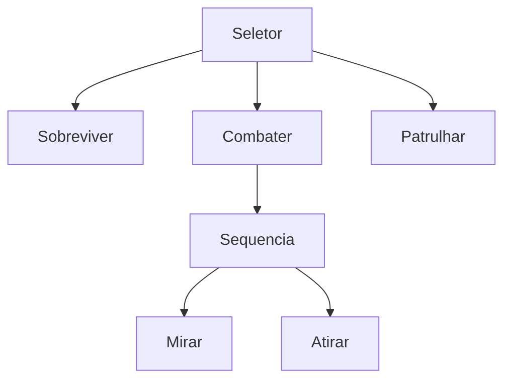

<!-- _class: cover -->


# Inteligência Artificial e Ilusão de Inteligência

## Semana 4 — Árvores de Comportamento, Blackboard e Engenharia Reversa

<div class="meta">

**Módulo 1:** Como um NPC decide o que fazer?
**Apostila:** Parte II, Cap. 6; Parte VII, Cap. 14
**Micro Game:** NPC Decision (consolidação)

</div>

---

## Objetivos da aula

Ao final de hoje você será capaz de:

- explicar o problema consolidado que a árvore de comportamento resolve;
- diferenciar sequência, seletor e paralelo;
- explicar decoradores, folhas e Blackboard;
- aplicar o roteiro de seis etapas da Engenharia Reversa de IA;
- migrar a HFSM da Semana 3 para uma BT no Unity Behavior.

---

## Retomada da Semana 3

A HFSM organiza estados em hierarquia e elimina a redundância de regras repetidas.

Mas o acoplamento entre estados e a rigidez de reordenação continuam lá.

---

<!-- _class: question -->

# Como tornar a decisão do NPC modular e escalável?

O guarda precisa reordenar prioridades e reutilizar comportamentos sem reescrever transições inteiras. A HFSM ainda não resolve isso.

---

## O problema consolidado

Dois problemas vêm de FSM/HFSM: **acoplamento** e **rigidez de reordenação**.

Dois problemas vêm da árvore de decisão: ausência de **tempo/sequência** e fraca **reutilização**.

<div class="warning">

Reordenar prioridades em uma FSM/HFSM significa reescrever transições. Reutilizar um trecho de comportamento significa copiar e colar.

</div>

---

## A resposta: Árvore de Comportamento

O fluxo de decisão passa a morar **na estrutura da árvore**, não em transições espalhadas.

- Reordenar prioridades = reordenar filhos
- Reutilizar comportamento = reutilizar subárvore

---

## Nós compostos

| Nó | Semântica |
|---|---|
| **Sequência** | Todos os filhos precisam ter sucesso (E) |
| **Seletor** | Um filho precisa ter sucesso (OU) |
| **Paralelo** | Executa filhos simultaneamente |

---

<!-- _class: diagram -->

## Exemplo: sequência e seletor



---

## Decoradores e nós de folha

- **Decoradores**: modificam o resultado de um filho (inversor, repetidor, cooldown)
- **Ações e condições**: os nós de folha, onde o comportamento realmente acontece

<div class="tip">

Um decorador de cooldown evita que o guarda dispare o mesmo alerta a cada quadro.

</div>

---

## Blackboard: a memória compartilhada

Nós desacoplados precisam trocar informação sem se conhecer diretamente.

O Blackboard guarda essa informação — posição do jogador, munição, nível de alerta.

<div class="warning">

"Blackboard lata de lixo": chaves redundantes ou mal nomeadas destroem a organização que a BT deveria trazer.

</div>

---

## Funcionamento: o tick

A árvore é reavaliada a cada **tick**, do topo até o nó ativo.

| Estado de retorno | Significado |
|---|---|
| **Sucesso** | O nó completou seu objetivo |
| **Falha** | O nó não conseguiu completar |
| **Em execução** | O nó ainda está em andamento |

---

## Por que "em execução" importa

<div class="tip">

O estado "em execução" permite que uma sequência "lembre" onde parou, sem precisar de um estado persistente como na FSM.

</div>

Reavaliação em cascata também permite que uma ameaça maior interrompa uma subárvore de menor prioridade.

---

## Unity Behavior: a BT materializada

Demonstração ao vivo: seletor com dois ou três filhos e uma condição.

| Conceito teórico | Elemento no Unity Behavior |
|---|---|
| Nó composto | Sequence / Selector no editor |
| Decorador | Modifier node |
| Blackboard | Blackboard asset do pacote |

> [!FIGURA]
>
> **Objetivo didático**
>
> Mostrar a correspondência entre seletor-raiz, sequências e Blackboard no editor do Unity Behavior.
>
> **Arquivo sugerido**
>
> ```
> assets/unity-behavior-guarda.webp
> ```
>
> **Descrição**
>
> Captura de tela do editor Unity Behavior com um seletor-raiz contendo as subárvores "Sobreviver", "Combater" e "Patrulhar", e o painel de Blackboard visível ao lado com as chaves do NPC guarda.
>
> **Como produzir**
>
> Screenshot direto do editor Unity durante a demonstração ao vivo, com anotações simples adicionadas no Krita.

---

## Panorama de terceiros

<div class="industry">

**NodeCanvas** e **Behavior Designer** oferecem editores visuais de BT similares, com recursos adicionais (FSM integrada, utilidade). Apresentados aqui apenas como panorama comparativo — sem uso prático nesta semana.

</div>

---

<!-- _class: section -->

# Engenharia Reversa de IA

Metodologia reutilizada a partir de hoje em todos os módulos seguintes.

---

## Por que a IA de jogos raramente é documentada

Estúdios protegem detalhes de implementação como vantagem competitiva.

O que resta ao analista: observar o comportamento e formular hipóteses.

---

## O roteiro de seis etapas

1. Definição do problema
2. Coleta de evidências
3. Registro das observações
4. Formulação de hipóteses
5. Validação
6. Documentação

---

## Rótulos de confiança

<div class="warning">

Toda afirmação sobre a IA de um jogo comercial deve trazer um rótulo: **[Documentado]**, **[Inferência]** ou **[Especulação]**.

</div>

Confundir inferência com certeza é o erro mais comum da Engenharia Reversa.

---

## Estudo de caso: Halo 2

Jogo sugerido pela Apostila — árvore de comportamento com fonte documentada (GDC 2005, Damian Isla).

Comportamento observado: alternância entre avançar, buscar cobertura, recuar e coordenar-se com outros NPCs.

---

## Perguntas para observação

- Quantos "modos" de comportamento é possível identificar?
- As decisões seguem uma ordem de prioridade fixa e visível?
- O NPC retoma uma atividade interrompida ou reinicia do zero?

<div class="tip">

O sinal de retomada aponta diretamente para Blackboard e reavaliação em cascata.

</div>

---

<!-- _class: section -->

# Implementação guiada

Migrando a HFSM da Semana 3 para Árvore de Comportamento.

---

## Passo a passo

1. Mapear superestados da Semana 3 para subárvores;
2. Definir a ordem de prioridade no seletor-raiz;
3. Construir sequências, condições e ao menos um decorador;
4. Documentar as chaves do Blackboard e quem as lê/escreve;
5. Testar se o comportamento observável se mantém equivalente.

---

<!-- _class: exercise -->

# Erro comum

Tratar o Blackboard sem disciplina, com chaves redundantes ou mal documentadas.

<div class="objectives">

Antes de implementar: liste nome, tipo e quais nós leem/escrevem cada chave.

</div>

---

## Desafio de Escolha Tecnológica — Módulo 1

Cenário: um NPC de suporte que alterna entre curar, seguir e revidar.

Compare ao menos duas soluções (FSM / HFSM / BT) e justifique por escrito a escolhida.

---

## Discussão técnica

<div class="warning">

O que a BT ainda não resolve bem? Escolher a melhor ação entre várias possíveis, ponderando fatores — problema em aberto para o Módulo 3.

</div>

---

<!-- _class: summary -->

## Resumo da semana

- BT resolve acoplamento e rigidez herdados de FSM/HFSM
- Sequência, seletor e paralelo estruturam o fluxo de decisão
- Decoradores, folhas e Blackboard compõem a árvore
- Tick e estados de retorno dão noção de duração
- Engenharia Reversa: roteiro de seis etapas e rótulos de confiança
- Módulo 1 encerrado: NPC Decision consolidado em BT + Blackboard

---

## Preparação para a Semana 5

**Tema:** Grafos e Representação do Espaço — abertura da Unidade II

- Ler o Capítulo 7 da Apostila
- Concluir as três entregas do Módulo 1 (Desafio, AI Design Log, Engenharia Reversa)

<div class="tip">

Nova pergunta: como um agente encontra seu destino? Navegação é um novo problema, não uma continuação do Módulo 1.

</div>
