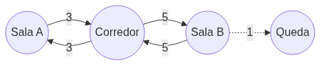
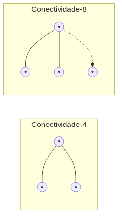

<!-- _class: cover -->

# Inteligência Artificial e Ilusão de Inteligência

## Semana 5 — Grafos e Representação do Espaço

**Módulo 2:** Como um agente encontra seu destino?
**Apostila:** Parte III, Cap. 7
**Micro Game:** Navigation (início)

---

## Objetivos da aula

Ao final de hoje você será capaz de:

- diferenciar busca de caminho (pathfinding) de direção/locomoção (steering);
- definir vértice, aresta, peso e direção em um grafo de navegação;
- comparar grades, waypoints e NavMesh;
- relacionar o pacote AI Navigation da Unity aos conceitos de grafo;
- configurar a primeira NavMesh do Micro Game Navigation.

---

## Encerramento da Unidade I

O Módulo 1 terminou consolidado: NPC Decision em BT + Blackboard.

Hoje abrimos a Unidade II com uma pergunta nova, não uma continuação.

---

<!-- _class: question -->

# Como um agente encontra seu destino?

O NPC já decidiu perseguir o jogador. Como ele calcula o caminho até lá?

---

## O problema: pathfinding vs. steering

Dois problemas distintos e complementares:

| Problema | Escopo |
|---|---|
| **Pathfinding** | Rota global até o destino |
| **Steering** | Ajuste local de movimento (obstáculos, curvas) |

Mover em linha reta ao destino falha diante de qualquer obstáculo — por isso os dois problemas não se confundem.

---

## Anatomia de um grafo

- **Vértice (nó):** um lugar possível
- **Aresta:** uma conexão entre dois lugares
- **Peso:** custo de percorrer a aresta
- **Direção:** aresta pode ser de mão única ou dupla

---

<!-- _class: diagram -->

## Grafo ponderado e direcionado

Aresta pontilhada: conexão de mão única (ex.: queda de plataforma).

---

## Custo e conectividade

O custo de um caminho é a **soma dos pesos** das arestas percorridas.

Componentes conexos indicam quais nós são alcançáveis entre si.

Checar a conectividade antes de disparar uma busca cara evita processamento desperdiçado em destinos inalcançáveis.

---

## Representação em memória

| Representação | Quando usar |
|---|---|
| **Lista de adjacência** | Grafos esparsos — dominante em pathfinding |
| **Matriz de adjacência** | Grafos densos, poucas consultas de vizinhança |

Grafos de jogos costumam ser esparsos: cada nó conecta poucos vizinhos.

---

## Três representações espaciais

Como o espaço navegável do jogo vira um grafo?

1. Grades
2. Grafos de waypoints
3. Malhas de navegação (NavMesh)

---

<!-- _class: diagram -->

## Grades: conectividade-4 e conectividade-8

Movimento diagonal custa √2 ≈ 1,41, não 1,0.

Atribuir custo igual a passos ortogonais e diagonais distorce o caminho "mais curto" calculado.

---

## Waypoints

Pontos posicionados manualmente pelo designer; arestas criadas por linha de visão.

- Vantagem: controle autoral preciso
- Limitação: movimento "amarrado aos trilhos"

---

## Malhas de navegação (NavMesh)

Polígonos convexos como nós; bordas compartilhadas como arestas.

Gerada automaticamente por **baking**, a partir da geometria da cena.

---

## Comparativo das três representações

| | Grade | Waypoints | NavMesh |
|---|---|---|---|
| **Nó** | Célula | Ponto manual | Polígono |
| **Obtenção** | Discretização | Autoria manual | Bake automático |
| **Memória** | Alta (fina) | Baixa | Média |
| **Atualização dinâmica** | Custosa | Manual | Suportada (NavMesh Obstacle) |

---

"Nó" é sempre um lugar no grafo — célula, ponto ou polígono são apenas formas diferentes de representar o mesmo papel abstrato.

---

<!-- _class: section -->

# Ferramentas oficiais

AI Navigation da Unity.

---

## AI Navigation: componentes

| Componente | Papel |
|---|---|
| **NavMesh Surface** | Gera a malha por bake |
| **NavMesh Agent** | Usa a malha para se deslocar |
| **NavMesh Modifiers/Areas** | Materializam pesos de aresta |
| **Off-Mesh Links** | Arestas adicionais, muitas vezes direcionadas |

---

## Demonstração ao vivo

Adição de um NavMesh Surface à cena de teste.

Parâmetros: Agent Radius, Agent Height, Max Slope, Step Height.

Bake e observação do recuo da malha em relação às paredes.

<!--
FIGURA A PRODUZIR (nota do apresentador — não aparece no slide)

Objetivo didático:
Mostrar visualmente a malha gerada pelo bake e seu recuo em relação às paredes da cena de teste.
Arquivo sugerido:
assets/navmesh-bake-cena-teste.webp
Descrição:
Captura de tela do editor Unity com a NavMesh (área azul) sobreposta à cena de teste (salas, corredor, obstáculos), evidenciando o recuo da malha em relação às paredes.
Como produzir:
Screenshot direto do editor Unity durante a demonstração ao vivo, com a malha visível (gizmo do NavMesh Surface ativado).
-->

---

Uma NavMesh construída para um agente específico (raio/altura incompatíveis com a geometria) gera buracos ou cobertura incorreta.

---

## Panorama de terceiros

**A\* Pathfinding Project** e **Recast & Detour** são alternativas relevantes ao AI Navigation. Apresentados aqui apenas como panorama comparativo — a escolha da ferramenta deve seguir a escolha da representação, não o contrário.

---

<!-- _class: section -->

# Implementação guiada

Início do Micro Game Navigation.

---

## Passo a passo

1. Preparar cena de teste (salas, corredor, obstáculos);
2. Adicionar NavMesh Surface e definir parâmetros de agente;
3. Executar o bake e verificar cobertura da malha;
4. Adicionar NavMesh Agent a um NPC de teste com destino fixo;
5. Testar deslocamento sem atravessar obstáculos.

---

<!-- _class: exercise -->

# Erro comum

Esquecer de verificar a conectividade da NavMesh, movendo um agente para uma área isolada por um obstáculo.

Antes de testar: confirme visualmente que origem e destino estão na mesma região conectada da malha.

---

## Correspondência teoria ↔ ferramenta

Ao final da implementação, cada grupo deve apontar na malha gerada:

- polígono = nó do grafo
- borda compartilhada = aresta

---

<!-- _class: summary -->

## Resumo da semana

- Pathfinding (rota global) é distinto de steering (ajuste local)
- Grafo: vértice, aresta, peso, direção
- Custo de caminho, conectividade e lista de adjacência
- Três representações: grades, waypoints, NavMesh
- AI Navigation: NavMesh Surface, Agent, Modifiers/Areas, Off-Mesh Links
- Micro Game Navigation: primeira NavMesh funcional

---

## Preparação para a Semana 6

**Tema:** Busca de Caminhos com A\* — abrindo a caixa-preta do NavMesh Agent

- Ler o Capítulo 8 da Apostila
- Garantir NavMesh funcional e agente se deslocando corretamente

A busca interna do NavMesh Agent foi usada como caixa-preta nesta semana. A Semana 6 mostra o algoritmo por trás dela.

