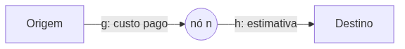
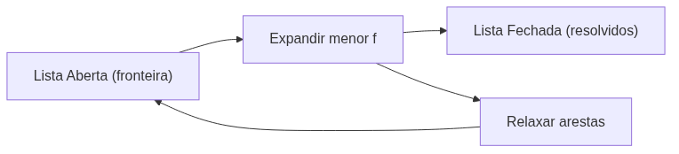

<!-- _class: cover -->


# Inteligência Artificial e Ilusão de Inteligência

## Semana 6 — Busca de Caminhos com A*

<div class="meta">

**Módulo 2:** Como um agente encontra seu destino?
**Apostila:** Parte III, Cap. 8
**Micro Game:** Navigation (evolução)

</div>

---

## Objetivos da aula

Ao final de hoje você será capaz de:

- explicar por que Dijkstra é uma busca não-informada e por que isso a torna ineficiente;
- definir `g(n)`, `h(n)` e `f(n) = g(n) + h(n)`;
- diferenciar heurística admissível de heurística consistente;
- selecionar a heurística adequada à conectividade da grade;
- relacionar o A* implementado à mão ao NavMesh Agent da Unity.

---

## Revisão rápida — Semana 5

A Semana 5 resolveu a **representação** do espaço: grafo, NavMesh.

Hoje resolvemos a **busca** sobre essa representação.

Polígono = nó. Borda compartilhada = aresta.

---

<!-- _class: question -->

# Como calcular o melhor caminho entre dois pontos?

O grafo já existe. Falta decidir qual caminho percorrer sobre ele.

---

## O problema: menor caminho em tempo real

Testar todos os caminhos possíveis é inviável.

Tensão entre três forças:

- **Otimalidade** — o caminho mais curto
- **Velocidade** — dentro do orçamento de quadro
- **Escalabilidade** — muitos agentes, grafos grandes

<div class="warning">

Um NPC com desvio absurdo quebra a ilusão de inteligência mesmo com IA correta.

</div>

---

## Dijkstra: busca não-informada

Expande "em mancha", em todas as direções, sem saber onde fica o destino.

- Garante o caminho ótimo
- Desperdiça exploração em direções irrelevantes

<div class="tip">

Dijkstra é cego em relação ao destino — só enxerga o custo já pago.

</div>

---

<!-- _class: diagram -->

## A busca informada: f(n) = g(n) + h(n)



`g(n)`: custo acumulado, exato.
`h(n)`: heurística, estimada.
`f(n)`: valor de avaliação — expande-se sempre o menor `f`.

---

## Dois casos-limite

| Condição | Resultado |
|---|---|
| `h(n) = 0` | Equivale a Dijkstra |
| Ignora `g(n)` | Busca Gulosa |

O A* fica entre os dois extremos: usa o que já foi pago e o que falta estimar.

---

## Admissibilidade e consistência

- **Admissível:** a heurística nunca superestima o custo restante
- **Consistente:** respeita a desigualdade triangular entre nós vizinhos

<div class="warning">

Uma heurística que superestima pode levar o A* a devolver um caminho não ótimo.

</div>

---

<div class="tip">

Consistência garante que nenhum nó fechado precise ser reprocessado — cada nó é resolvido definitivamente uma única vez.

</div>

---

## Laço principal do A*

1. Retirar o nó de menor `f` da lista **aberta**
2. Mover esse nó para a lista **fechada**
3. Relaxar as arestas para seus vizinhos
4. Repetir até alcançar o destino
5. Reconstruir o caminho por **predecessores**

---

<!-- _class: diagram -->

## Listas aberta e fechada



---

## Heurísticas comuns

| Heurística | Conectividade |
|---|---|
| **Manhattan** | Grade-4 |
| **Chebyshev / octile** | Grade-8 |
| **Euclidiana** | Movimento livre / NavMesh |

<div class="warning">

Usar Manhattan em grade-8 (ou vice-versa) distorce admissibilidade ou eficiência.

</div>

---

## A* ponderado

*Weighted A**: multiplica `h(n)` por um fator > 1.

Troca **otimalidade** por **velocidade** — útil quando "bom o bastante" já resolve.

---

<!-- _class: exercise -->

# Erro comum

Confundir `g(n)` (exato, já pago) com `h(n)` (estimado, ainda não pago).

<div class="objectives">

Para cada nó do caminho, pergunte: este valor já foi pago, ou é apenas um palpite?

</div>

---

## Traço de execução

A* contornando um obstáculo:

- exploração eficiente em terreno aberto
- exploração mais custosa perto de obstáculos

> [!FIGURA]
>
> **Objetivo didático**
>
> Mostrar visualmente as listas aberta e fechada se expandindo ao contornar um obstáculo.
>
> **Arquivo sugerido**
>
> ```
> assets/astar-traco-execucao-obstaculo.webp
> ```
>
> **Descrição**
>
> Grade lógica sobreposta à cena de teste, com células da lista fechada em uma cor, células da lista aberta (fronteira) em outra, e o caminho final destacado contornando um obstáculo central.
>
> **Como produzir**
>
> Screenshot do script de A* simplificado rodando sobre a grade lógica, com gizmos coloridos para aberta/fechada, capturado durante a demonstração ao vivo no Unity.

---

## Vantagens e limitações

| Vantagens | Limitações |
|---|---|
| Ótimo (com heurística admissível) | Memória por nó armazenado |
| Completo | Custo cresce com muitos agentes |
| Geral e sintonizável | Nós simétricos redundantes |
| Eficiente com boa heurística | Recálculo em mundos dinâmicos |

---

<!-- _class: section -->

# Ferramentas oficiais

O A* já roda dentro do NavMesh Agent.

---

## A* como serviço embutido

| Elemento da teoria | Componente na Unity |
|---|---|
| Peso de aresta | NavMesh Areas (custo por região) |
| Aresta adicional | Off-Mesh Links |
| Busca A* | Executada internamente pelo NavMesh Agent |

<div class="industry">

**A\* Pathfinding Project** é citado como alternativa de terceiros para grades e controle direto do algoritmo — sem uso prático nesta semana.

</div>

---

## Demonstração ao vivo

Implementação própria simplificada de A* sobre uma grade lógica.

Finalidade **exclusivamente didática**: tornar visível o que a NavMesh já resolve internamente.

---

<!-- _class: section -->

# Implementação guiada

Evolução do Micro Game Navigation.

---

## Passo a passo

1. Retomar a cena da Semana 5 (NavMesh já funcional);
2. Adicionar um novo destino ou obstáculo dinâmico;
3. Testar o recálculo de rota pelo NavMesh Agent;
4. Descrever, em grupo, os valores de `g`, `h` e `f` em dois nós do caminho;
5. (Opcional) implementar uma versão mínima de A* sobre uma grade auxiliar.

---

## Discussão técnica

Quando compensa controlar o A* diretamente em vez de usar o NavMesh Agent?

<div class="tip">

Grades e atualização dinâmica intensa favorecem controle direto. Cenários gerais favorecem confiar na NavMesh.

</div>

---

<!-- _class: summary -->

## Resumo da semana

- Dijkstra é ótimo, mas cego ao destino
- `f(n) = g(n) + h(n)`: custo pago + estimativa
- Admissibilidade garante otimalidade; consistência dispensa reprocessamento
- Heurística deve casar com a conectividade da grade
- Listas aberta e fechada conduzem o laço principal
- NavMesh Agent já executa um A* internamente

---

## Preparação para a Semana 7

**Tema:** JPS+ e Otimizações — encerramento do Módulo 2

- Ler o Capítulo 9 da Apostila
- Garantir o Micro Game Navigation evoluído, com recálculo de rota funcional

<div class="tip">

Nós simétricos redundantes no A* em grades abertas motivam o JPS+ — a solução vem na próxima semana.

</div>
