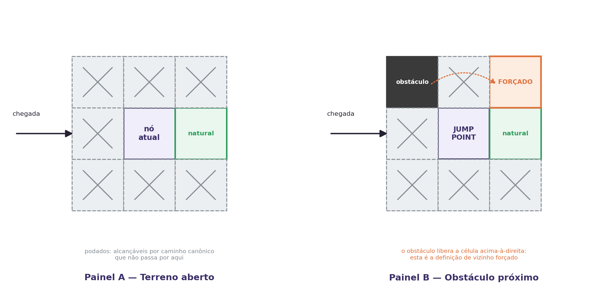
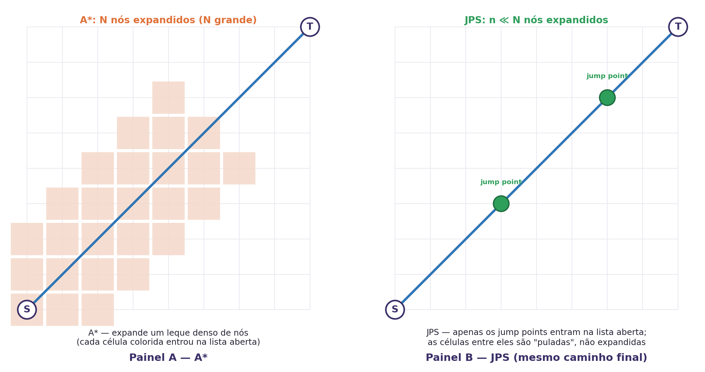
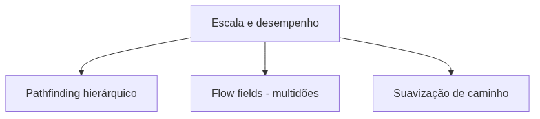
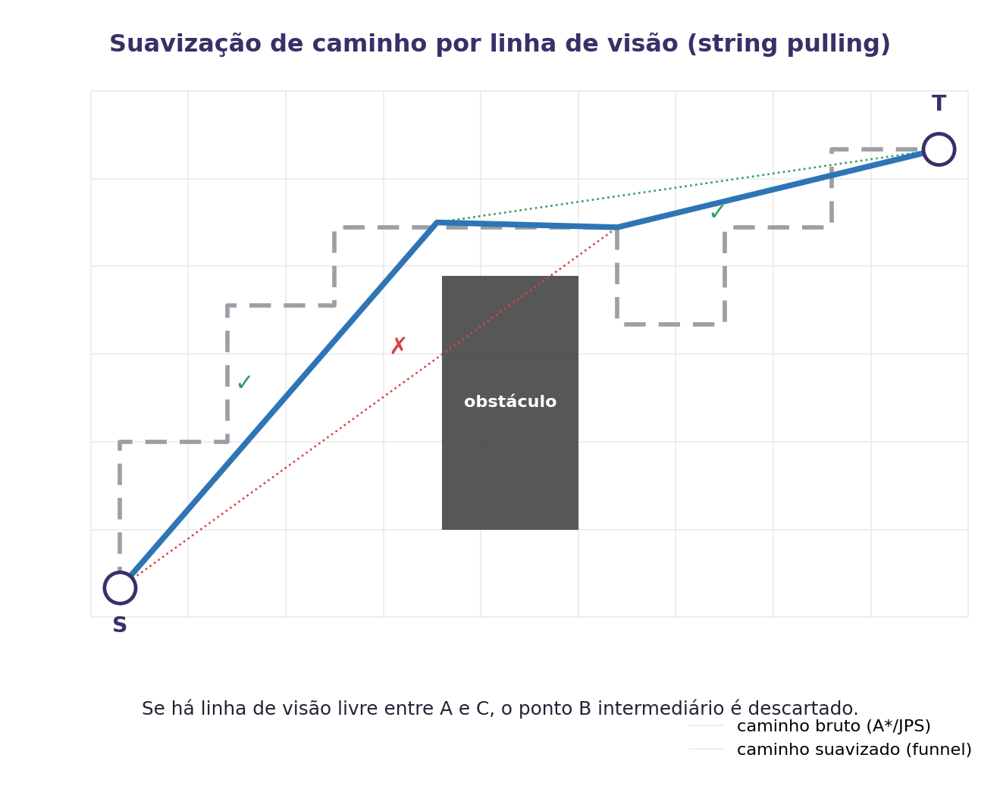

<!-- _class: cover -->

# Inteligência Artificial e Ilusão de Inteligência

## Semana 7 — JPS+ e Otimizações de Busca

**Módulo 2:** Como um agente encontra seu destino?
**Apostila:** Parte III, Cap. 9
**Micro Game:** Navigation (consolidação final)

---

## Objetivos da aula

Ao final de hoje você será capaz de:

- explicar a simetria de caminhos e o desperdício do A* em grades grandes;
- definir vizinho natural, podado e forçado;
- descrever o JPS como o mesmo A*, com sucessores podados;
- explicar o que o JPS+ pré-calcula e por que isso o torna mais rápido;
- julgar quando o JPS+ é ou não apropriado.

No Encontro 2: consolidar o Micro Game Navigation, aplicar o Desafio de Escolha Tecnológica do Módulo 2 e conduzir o 2º momento de Engenharia Reversa.

---

## Retomada da Semana 6

A Semana 6 resolveu a busca **ótima**: A*, com `f(n) = g(n) + h(n)`.

Hoje: o que fazer quando o A*, bem implementado, ainda é lento demais?

---

<!-- _class: question -->

# Como tornar a navegação eficiente em larga escala?

Grades grandes e abertas fazem o A* explorar rotas redundantes de mesmo custo.

---

## O problema: simetria de caminhos

Em campo aberto, muitos caminhos têm o mesmo custo.

O A* expande todos — um "leque" de nós redundantes.

O desperdício é pequeno em grafos irregulares (NavMesh), mas grande em grades regulares e uniformes.

---

## Vizinhos naturais, podados e forçados

Um obstáculo **força** uma decisão que não existiria em terreno aberto.

| Tipo de vizinho | Significado |
|---|---|
| **Natural** | Direção já coberta pelo caminho até aqui |
| **Podado** | Redundante, descartado da expansão |
| **Forçado** | Só existe por causa de um obstáculo próximo |

---

<!-- _class: diagram -->

## Jump point: nó com vizinho forçado

À esquerda, terreno aberto: só o vizinho natural importa, os demais são podados. À direita, um obstáculo libera um vizinho forçado — o nó vira jump point. JPS pula direto até o próximo ponto de decisão, em vez de expandir vizinho por vizinho.

---

**Atenção:** JPS é o mesmo A* — mesma `f = g + h`, mesma garantia de otimalidade. Muda apenas a geração de sucessores.

---

## JPS+: a tabela de saltos

Pré-calcula, para cada célula e direção, a distância até o próximo jump point.

Troca **varredura em tempo de busca** por **consulta em tempo constante**.

Complementado por Goal Bounding.

---

## Os três custos do pré-processamento

| Custo | Implicação |
|---|---|
| **Memória** | Tabela por célula e direção |
| **Tempo de construção** | Pré-processamento antes de qualquer busca |
| **Rigidez** | Mapa precisa ser recalculado se mudar |

**Erro comum:** aplicar JPS+ em mundos dinâmicos. A tabela pressupõe mapa estático.

---

## Comparação de desempenho

| Tipo de mapa | Ganho do JPS+ sobre A* |
|---|---|
| Grade aberta e uniforme | Até uma ordem de magnitude |
| Mapa labiríntico | Decrescente |
| Grade pequena | Marginal |

Medir antes de otimizar — otimização é resposta a um problema medido, não um troféu a colecionar.

---

<!-- _class: diagram -->

## Por que o JPS é mais rápido: menos nós na lista aberta

Mesmo caminho ótimo nos dois painéis. A diferença de velocidade vem inteiramente do número de nós inseridos na lista aberta — o A* insere quase toda a fronteira; o JPS insere só os jump points.

---

<!-- _class: diagram -->

## Panorama de outras otimizações

| Técnica | Problema que ataca | Custo |
|---|---|---|
| **Pathfinding hierárquico (HPA\*)** | Mapas enormes: planeja por regiões, depois dentro de cada uma — como planejar uma viagem por estradas e só depois por ruas | Hierarquia a construir e manter; caminho levemente subótimo |
| **Flow fields** | Multidões: centenas de agentes com o mesmo destino — calcula-se **um** campo de direções por destino, não uma busca por agente | Só compensa quando muitos agentes compartilham destino |
| **Suavização de caminho** | Caminho "quadriculado" do A*/JPS não parece natural — poucos jogos dispensam este passo | Pós-processamento leve; não muda a rota, só sua aparência |

---

<!-- _class: diagram -->

## Suavização de caminho (string pulling)

O caminho bruto de A*/JPS "cola" nas quinas da grade. Se há linha de visão livre entre dois pontos, os pontos intermediários são descartados — não muda a rota, só a torna crível. Central para a ilusão de inteligência.

---

## Ferramentas

| Situação | Solução |
|---|---|
| Suavização nativa de caminho | NavMesh Agent (*funnel*) |
| JPS/JPS+ na Unity | **Não existe nativo** — NavMesh é irregular, não grade |
| Grades e controle direto | A* Pathfinding Project (terceiros) |

**A\* Pathfinding Project** é a alternativa do ecossistema Unity para grades e otimizações comparáveis ao JPS+ — sem uso prático obrigatório nesta semana.

---

<!-- _class: exercise -->

# Erro comum

Achar que o JPS troca otimalidade por velocidade.

Lembre: mesma `f = g + h`, mesma garantia de otimalidade. Apenas a geração de sucessores muda.

---

<!-- _class: section -->

# Consolidação do Micro Game Navigation

Entrega final do Módulo 2.

---

## O que consolidar hoje

- NavMesh e NavMesh Agent funcionais, com o destino/obstáculo da Semana 6;
- capacidade de explicar a navegação em termos de grafo, heurística e `f = g + h`;
- justificativa técnica: quando JPS+, pathfinding hierárquico ou flow field se aplicariam ao próprio AI Playground.

---

## Discussão técnica: quando cada otimização compensa

Tratar toda otimização como sempre desejável, sem considerar seu custo de implementação e manutenção, é o erro mais comum desta semana.

Para o próprio AI Playground: alguma otimização deste capítulo se justifica, ou a NavMesh já basta?

---

## Desafio de Escolha Tecnológica — Módulo 2

Cenário: mapa de estratégia grande, aberto e estático, com centenas de unidades buscando caminho simultaneamente.

Compare ao menos duas soluções (NavMesh/A*, JPS+, flow field) e justifique por escrito a escolhida.

---

<!-- _class: section -->

# Engenharia Reversa de IA

Segundo momento formal — roteiro completo de seis etapas.

---

## Estudo de caso: StarCraft II

Deslocamento coordenado de grandes grupos de unidades: contorno de obstáculos, recálculo de rota, comportamento ao colidir ou se aglomerar.

---

## Perguntas para observação

- As unidades calculam rota individual, ou compartilham uma solução comum de navegação?
- Como reagem a um obstáculo inesperado no meio do trajeto?
- O comportamento sugere busca ponto a ponto (A*/JPS+) ou navegação de multidões (flow field)?

Toda afirmação exige rótulo de confiança: **[Documentado]**, **[Inferência]** ou **[Especulação]**.

**Cuidado:** navegação individual (busca ponto a ponto, A*/JPS+) e navegação de multidões (flow field) parecem semelhantes de longe. Justifique a hipótese pela evidência observada — por exemplo, unidades fluindo na mesma direção geral perto do destino sugere flow field; rotas individuais distintas sugerem busca por unidade.

---

<!-- _class: summary -->

## Resumo da semana

- Simetria de caminhos motiva o JPS+ em grades grandes e abertas
- Vizinho forçado nasce de um obstáculo — origem do jump point
- JPS é o mesmo A*, com sucessores podados
- JPS+ pré-calcula uma tabela de saltos; exige mapa estático
- Não há JPS/JPS+ nativo na Unity; NavMesh Agent já suaviza caminhos
- Pathfinding hierárquico, flow fields e suavização atacam problemas diferentes (mapas enormes, multidões, aparência do movimento)
- Módulo 2 encerrado: quatro entregas — Navigation consolidado, AI Design Log, Desafio e Engenharia Reversa

---

## Preparação para a Semana 8

**Tema:** Checkpoint do AI Playground — abertura da Unidade III

- Concluir as quatro entregas do Módulo 2: Micro Game consolidado (50%), AI Design Log (25%), Desafio (15%), Engenharia Reversa (10%)
- Preparar a apresentação técnica intermediária do projeto

Nova pergunta: como um NPC escolhe sua melhor ação? Não é continuação da navegação — é um novo problema.

