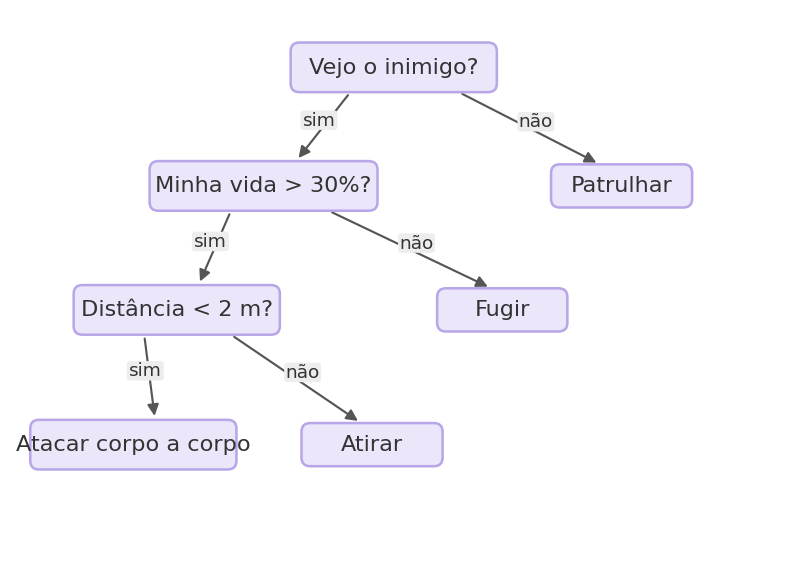

<!-- _class: cover -->

# Inteligência Artificial e Ilusão de Inteligência

## Semana 8 — Árvores de Decisão e introdução aos Mapas de Influência

**Módulo 3:** Como um NPC escolhe sua melhor ação?
**Apostila:** Parte II, Cap. 5; Parte IV, Cap. 10 (introdução)
**Micro Game:** Tactical AI (início)

---

## Objetivos da aula

Ao final de hoje você será capaz de:

- diferenciar o problema da árvore de decisão do problema da FSM/HFSM;
- descrever nó, ramo e folha, e a avaliação da raiz até a ação;
- distinguir árvore de decisão de árvore de comportamento;
- justificar a ordenação de testes por custo e poder decisório;
- reconhecer o mapa de influência como resposta a "onde ir?".

---

## Retomada dos Módulos 1 e 2

**Módulo 1:** como um NPC decide o que fazer — FSM, HFSM, Behavior Trees, Blackboard.

**Módulo 2:** como um agente encontra seu destino — NavMesh, A*, JPS+.

Hoje: um novo problema. Nenhum dos dois módulos anteriores resolve *qual ação escolher agora*.

---

<!-- _class: question -->

# Como um NPC escolhe sua melhor ação?

A partir de várias condições observadas ao mesmo tempo — sem memória de estado.

---

## O problema da árvore de decisão

FSM pergunta: **"em que modo estou?"**

Árvore de decisão pergunta: **"qual ação, agora, dado este conjunto de condições?"**

Não há necessidade intrínseca de memória de estado — cada avaliação parte do zero.

---

<!-- _class: diagram -->

## Nós, ramos e folhas

A avaliação percorre a raiz até uma folha — sempre a mesma ação para o mesmo conjunto de condições.

---

## Árvore de decisão × árvore de comportamento

| Aspecto | Árvore de decisão | Árvore de comportamento |
|---|---|---|
| **Nós internos representam** | Testes/condições | Controle de fluxo (sequência, seletor, paralelo) |
| **Folhas representam** | A ação escolhida | Tarefas executáveis |
| **Propósito** | Escolher uma ação | Orquestrar uma sequência |
| **Estados de retorno** | Ausentes | Sucesso, falha, em execução |
| **Noção de tempo** | Nenhuma | Central |
| **Reutilização/composição** | Limitada | Alta |

---

**Erro comum:** tratar a árvore de decisão como sinônimo da árvore de comportamento por compartilharem a forma de árvore. A árvore de decisão escolhe; não orquestra sequência.

---

## Ordenação de testes

Testes mais **baratos e decisivos** devem ficar perto da raiz.

A ordenação afeta o **custo de avaliação** — nunca o resultado final.

Profundidade maior custa mais para avaliar e reduz a legibilidade da árvore.

---

## Árvore autoral × árvore aprendida

Nesta disciplina, a árvore de decisão é sempre **autoral** — escrita à mão pelo designer.

Existe também a árvore de decisão **aprendida** (ID3/entropia): construída automaticamente a partir de dados, tema do aprendizado de máquina.

Mesma estrutura de dados, filosofias opostas: regras controláveis versus modelo induzido de dados. A variante aprendida reaparece na Parte VI.

---

## Vantagens e limitações

| Vantagens | Limitações |
|---|---|
| Simplicidade | Ausência de tempo |
| Baixo custo | Sem sequenciamento |
| Transparência | Baixa reutilização e composição |

Essas limitações motivaram a adoção das árvores de comportamento pela indústria (Módulo 1).

---

## Ferramentas

| Situação | Solução |
|---|---|
| Árvore de decisão nativa | **Não existe ferramenta dedicada na Unity** |
| Implementação | C# ou Visual Scripting |
| Reaparição dentro do Behavior Tree | Nós de condição do Unity Behavior |

---

<!-- _class: question -->

# Do "como chegar?" ao "onde ir?"

O pathfinding (Módulo 2) não resolve tudo.

---

## Três situações que o pathfinding não resolve

- onde se posicionar para ter **cobertura**;
- por onde um **exército** deve avançar;
- para onde **fugir** de uma ameaça.

O mapa de influência responde "vale a pena ir?" — uma pergunta avaliativa, não topológica.

---

## Campo escalar: fonte, propagação, decaimento

Introdução apenas — aprofundamento na Semana 9.

- **Fonte:** ponto de origem de um valor de influência;
- **Propagação:** espalhamento desse valor pelo mapa;
- **Decaimento:** redução do valor com a distância da fonte.

---

**Atenção:** não confundir o mapa de influência com a grade de navegação do Módulo 2. A grade responde "posso ir?" (topológico); o mapa de influência responde "vale a pena ir?" (avaliativo).

---

<!-- _class: exercise -->

# Erro comum

Expressar, na árvore de decisão, uma sequência de ações com dependência de sucesso ("faça A, depois B").

A árvore de decisão escolhe uma ação. Sequenciar é território das árvores de comportamento, já disponíveis do Módulo 1.

---

<!-- _class: section -->

# Micro Game Tactical AI — início

Primeira árvore de decisão de seleção de alvo do NPC tático.

---

## O que implementar hoje

- dois ou três alvos candidatos (jogador e um ou dois aliados simulados), cada um com distância, vida e ameaça observáveis;
- árvore de decisão em C# ou Visual Scripting, com nós, ramos e folhas de **alvo** identificáveis;
- teste de ao menos dois caminhos de avaliação distintos, resultando em alvos diferentes;
- justificativa da ordenação dos testes escolhida.

<!--
FIGURA A PRODUZIR (nota do apresentador — não aparece no slide)

Objetivo didático:
Apoiar a implementação guiada, mostrando a árvore de decisão de seleção de alvo do NPC tático já desenhada antes da codificação.
Arquivo sugerido:
assets/arvore-decisao-npc-tatico.webp
Descrição:
Diagrama de árvore com raiz "Há aliado com vida crítica?", ramificando em "não" para um teste "Algum alvo representa ameaça imediata?" e daí para um teste de distância entre os alvos restantes, com folhas nomeando o alvo escolhido (Aliado ferido, Jogador, Alvo mais próximo) em vez de uma ação — reforçando que a folha desta árvore é um alvo, não uma ação.
Como produzir:
Diagrama vetorial produzido no Krita a partir do esboço em papel elaborado pelos grupos durante a atividade de laboratório.
-->

---

<!-- _class: section -->

# Apresentação Técnica Intermediária

Checkpoint do AI Playground — Módulos 1 e 2.

---

## Critérios do checkpoint

| Critério | O que observar |
|---|---|
| **Comunicação Técnica** | Clareza ao explicar problema, solução e decisões dos Micro Games NPC Decision e Navigation |
| **Evolução ao Longo do Semestre** | Incorporação consistente do feedback recebido nos Módulos 1 e 2 |

**Formato:** rodízio durante o laboratório — 4 a 5 min de arguição por grupo, na própria bancada.

O checkpoint corresponde a 10% da nota final do semestre.

---

<!-- _class: summary -->

## Resumo da semana

- Árvore de decisão escolhe uma ação a partir de condições, sem memória de estado
- Nó, ramo, folha — avaliação da raiz até a ação
- Diferente da árvore de comportamento: sem tempo, sem sequenciamento
- Ordenação de testes afeta custo, não resultado
- Mapa de influência: nova pergunta ("onde ir?"), introdução apenas
- Micro Game Tactical AI iniciado — seleção de alvo por árvore de decisão; checkpoint do AI Playground arguido em rodízio

---

## Preparação para a Semana 9

**Tema:** Mapas de Influência (aprofundamento) e Utility AI — encerramento do Módulo 3 e da Unidade III

- Confirmar árvore de decisão de seleção de alvo funcional em todos os grupos
- Revisar o conceito de campo escalar apresentado hoje

Quatro entregas na Semana 9: Micro Game Tactical AI consolidado (50%), AI Design Log (25%), Desafio de Escolha Tecnológica (15%) e 3º momento de Engenharia Reversa (10%).

