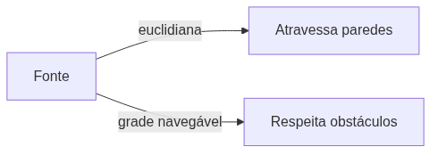

<!-- _class: cover -->

# Inteligência Artificial e Ilusão de Inteligência

## Semana 9 — Mapas de Influência (aprofundamento) e Utility AI

**Módulo 3:** Como um NPC escolhe sua melhor ação?
**Apostila:** Parte IV, Cap. 10 (10.2–10.7); extensão Utility AI
**Micro Game:** Tactical AI (consolidação)

---

## Objetivos da aula

Ao final de hoje você será capaz de:

- explicar fonte, propagação e decaimento de um campo de influência;
- comparar decaimento euclidiano com decaimento pela grade navegável;
- descrever a combinação de camadas em campos derivados (controle, tensão, ameaça);
- justificar as técnicas que viabilizam a atualização em tempo real;
- relacionar a IA de Utilidade à mesma lógica de combinação ponderada.

---

## Retomada da Semana 8

**Semana 8:** árvore de decisão escolhe, entre alvos candidatos (jogador, aliados), qual deve receber a ação do NPC — introdução ao mapa de influência.

**Pergunta em aberto:** "posso ir?" (NavMesh, Módulo 2) já foi respondida. Hoje: "vale a pena ir?"

O mapa de influência responde a uma pergunta avaliativa, não topológica.

---

<!-- _class: question -->

# Como um NPC escolhe sua melhor ação?

Parte 2 — avaliando múltiplas condições ao mesmo tempo, de forma ponderada.

---

## Fonte, propagação e decaimento

- **Fonte:** ponto de origem do valor de influência;
- **Propagação:** espalhamento por vizinhança, célula a célula;
- **Decaimento:** redução do valor com a distância da fonte.

Duas formas de medir distância: **euclidiana** ou pela **grade navegável** (distância de caminhada).

---

<!-- _class: diagram -->

## Decaimento euclidiano × decaimento pela grade

A distância euclidiana ignora obstáculos; a distância pela grade produz avaliação tática fiel.

---

**Erro comum:** usar decaimento euclidiano sem perceber que a influência "atravessa" paredes, produzindo avaliações táticas incorretas.

---

## Combinação de camadas

Camadas simples (aliada, inimiga) se combinam por **soma ponderada célula a célula**.

| Camada derivada | Origem |
|---|---|
| Controle | Influência aliada − inimiga |
| Tensão | Proximidade entre forças opostas |
| Ameaça / Segurança | Camada inimiga isolada / invertida |

---

## Atualização em tempo real

Recalcular o campo inteiro a cada quadro é inviável.

| Técnica | Ideia |
|---|---|
| Baixa frequência | Atualizar a cada N quadros |
| Atualização incremental | Recalcular apenas o que mudou |
| *Time-slicing* | Dividir o cálculo ao longo de vários quadros |
| Resolução reduzida | Grade mais grosseira que a de navegação |

---

**Erro comum:** recalcular o mapa de influência inteiro a cada quadro, ignorando as quatro técnicas de viabilização.

---

## Exemplos de aplicação

- **Seleção de cobertura** — qual célula oferece proteção contra ameaças visíveis;
- **Avanço de exército** — por onde concentrar forças com menor exposição;
- **Mapa de perigo** — descida de gradiente para se afastar de regiões de risco;
- **Controle territorial** — visualização de domínio de área (mapas de calor de RTS).

**Jogos conhecidos:** *Age of Empires*, *Civilization*, *StarCraft*.

---

## Vantagens e limitações

| Vantagens | Limitações |
|---|---|
| Generalidade e integração de fatores | Custo de atualização |
| Comportamento emergente e crível | Dilema de resolução |
| Controle de autoria (pesos) | Memória por camada, escalabilidade |

---

## Ferramentas

| Situação | Solução |
|---|---|
| Mapa de influência nativo | **Não existe ferramenta dedicada na Unity** |
| Implementação | C# sobre grid / NavMesh (Job System/Burst para escalar) |
| Termo de comparação | EQS da Unreal — campo persistente e global × consulta pontual |

---

<!-- _class: question -->

# Da posição ao alvo

O mapa de influência escolhe **onde ir**. E entre vários alvos candidatos — os mesmos da árvore de decisão da Semana 8 —, qual merece a ação do NPC?

---

## Utility AI: mesma lógica, mesmo alvo

IA de Utilidade combina considerações ponderadas (distância, vida, ameaça) para escolher o **alvo** de maior valor — os mesmos três atributos já testados pela árvore de decisão, agora avaliados de forma contínua.

Mesmo problema da Semana 8 (qual alvo?), mesma lógica de combinação ponderada do mapa de influência — testes sim/não viram pontuação gradual.

---

## Curvas de utilidade

Cada consideração usa uma curva diferente para transformar o valor bruto em pontuação (0 a 1):

| Consideração | Forma da curva | Ideia |
|---|---|---|
| Distância | Decrescente acentuada | Alvo próximo pontua muito mais que um pouco mais distante |
| Vida do alvo | Linear decrescente | Quanto menor a vida, maior a pontuação (alvo mais vulnerável) |
| Ameaça | Degrau | Ameaça ativa pontua 1,0; ausência de ameaça pontua 0,0 |

A forma da curva é a principal alavanca de design da IA de Utilidade.

---

## Exemplo: três alvos candidatos

Mesmos candidatos da árvore de decisão (Semana 8): Jogador, Aliado A, Aliado B.

| Alvo | Distância | Vida | Ameaça | Utilidade |
|---|---|---|---|---|
| Jogador | 8 m → 0,4 | 90% → 0,1 | Atacando → 1,0 | **0,55** |
| Aliado A | 3 m → 0,8 | 20% (crítica) → 0,8 | Nenhuma → 0,0 | 0,48 |
| Aliado B | 15 m → 0,1 | 100% → 0,0 | Nenhuma → 0,0 | 0,03 |

Pesos: distância 0,3 · vida 0,3 · ameaça 0,4 → Utilidade = Σ (peso × pontuação)

O Jogador vence por pouco: mesmo mais distante que o Aliado A, a ameaça ativa (peso 0,4) pesa mais. Mudar os pesos muda o alvo escolhido — é isso que o grupo deve justificar.

---

## Ferramentas para Utility AI

Assim como o mapa de influência, **não há pacote oficial da Unity** para Utility AI.

Implementação própria em C#, como serviço consultado pelos NPCs.

---

**Erro comum:** atribuir pesos arbitrários à função de utilidade, sem justificar por que uma consideração pesa mais que outra.

---

<!-- _class: exercise -->

# Erro comum

Confundir o mapa de influência com a grade de navegação (NavMesh) do Módulo 2, por compartilharem a grade como suporte.

A grade de navegação responde "posso ir?" (topológico). O mapa de influência responde "vale a pena ir?" (avaliativo).

---

<!-- _class: section -->

# Micro Game Tactical AI — consolidação

Árvore de decisão (Semana 8) + mapa de influência e/ou Utility AI.

---

## O que implementar hoje

- grade simples com ao menos uma fonte de influência, propagação e decaimento em baixa frequência; **e/ou**
- função de utilidade ponderada para os **mesmos alvos candidatos** da árvore de decisão da Semana 8 (jogador, aliados), usando os mesmos três atributos (distância, vida, ameaça);
- integração com a árvore de decisão já implementada na Semana 8, comparando o alvo escolhido pelos dois métodos para a mesma configuração;
- justificativa dos pesos, das curvas de utilidade e/ou da frequência de atualização escolhidos.

<!--
FIGURA A PRODUZIR (nota do apresentador — não aparece no slide)

Objetivo didático:
Tornar visível, antes da implementação, como fonte, propagação e decaimento se distribuem sobre uma grade com obstáculo.
Arquivo sugerido:
assets/mapa-influencia-grade.webp
Descrição:
Grade de células coloridas por intensidade de influência, com uma fonte destacada, um obstáculo interrompendo a propagação e uma legenda de decaimento por cor.
Como produzir:
Captura de tela do próprio Micro Game em modo debug (visualização da grade via Gizmos no Unity), com anotações adicionadas no Krita.
-->

---

<!-- _class: section -->

# Desafio de Escolha Tecnológica — Módulo 3

Cenário: um esquadrão de NPCs decide, simultaneamente, quem avança, quem cobre e quem recua.

---

## O que é esperado

Comparar ao menos **duas soluções** (árvore de decisão, mapa de influência, IA de utilidade) e justificar a escolha, considerando:

- requisitos do cenário;
- limitações de cada abordagem;
- ferramentas disponíveis;
- contexto do AI Playground do grupo.

---

<!-- _class: section -->

# 3º Momento de Engenharia Reversa

Dois casos possíveis, ambos analisados na Apostila:

- **Age of Empires / Civilization** (seção 15.7) — mapas de influência, decisão espacial
- **The Sims** (seção 15.4) — IA de utilidade, decisão entre ações concorrentes

---

## Perguntas para observação

- As posições escolhidas avaliam múltiplos fatores ao mesmo tempo, ou um critério único?
- Há reavaliação contínua da posição, ou a escolha é feita uma vez só?
- O comportamento é mais compatível com avaliação espacial, de ações, ou ambas?

Aplicar os rótulos [Documentado] / [Inferência] / [Especulação] a cada hipótese.

---

<!-- _class: summary -->

## Resumo da semana

- Fonte, propagação e decaimento formam o campo escalar do mapa de influência
- Decaimento pela grade navegável é preferível ao euclidiano para fidelidade tática
- Camadas simples se combinam por soma ponderada em campos derivados
- Atualização viável exige baixa frequência, incremental, *time-slicing* ou resolução reduzida
- Utility AI generaliza a combinação ponderada da escolha de posições para a escolha de alvos, continuando por pesos e curvas a mesma seleção de alvo (jogador, aliados) iniciada por testes sim/não na árvore de decisão da Semana 8
- Nenhuma das duas técnicas possui solução oficial da Unity — implementação própria em C#
- Módulo 3 e Unidade III encerrados: Micro Game, Desafio e Engenharia Reversa entregues

---

## Preparação para a Semana 10

**Tema:** Minimax e Busca Adversarial — abertura da Unidade IV

- Leitura prévia da Parte V, Cap. 11 da Apostila
- Nova pergunta: "como derrotar um adversário inteligente?" — não é continuação direta do Módulo 3

O Micro Game Board Game AI será implementação própria em C#, sem solução oficial da Unity para busca adversarial.

